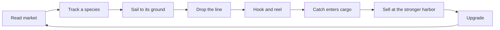
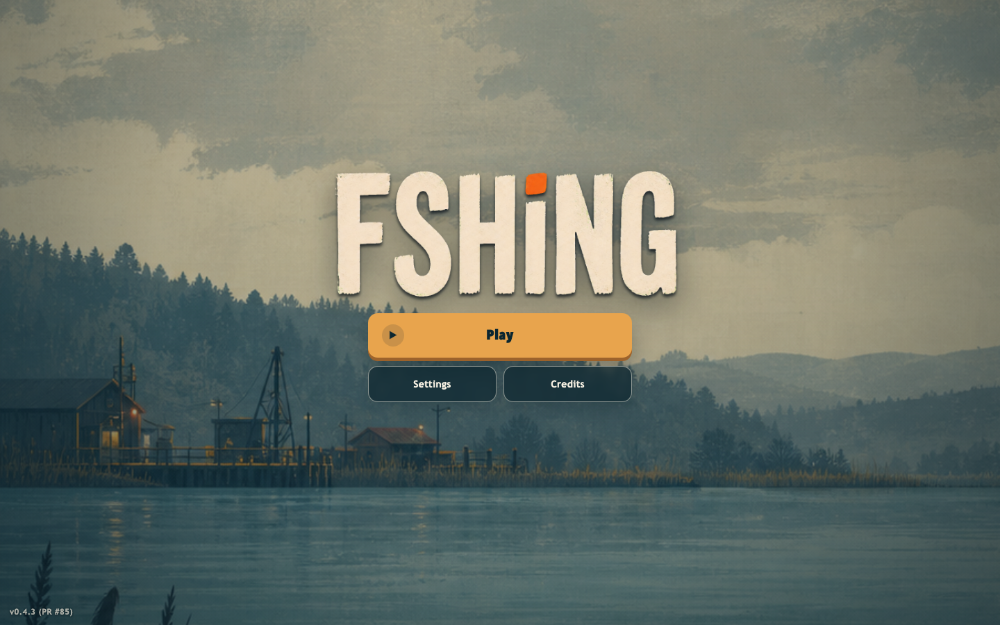
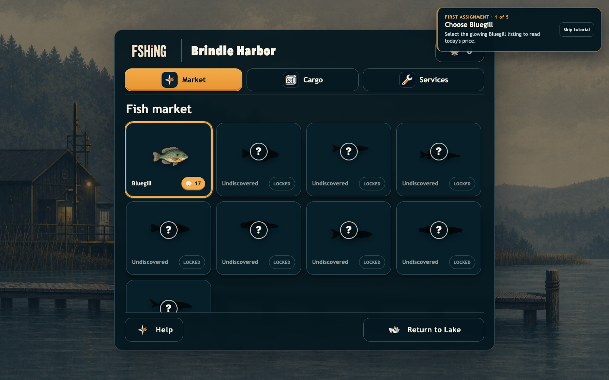
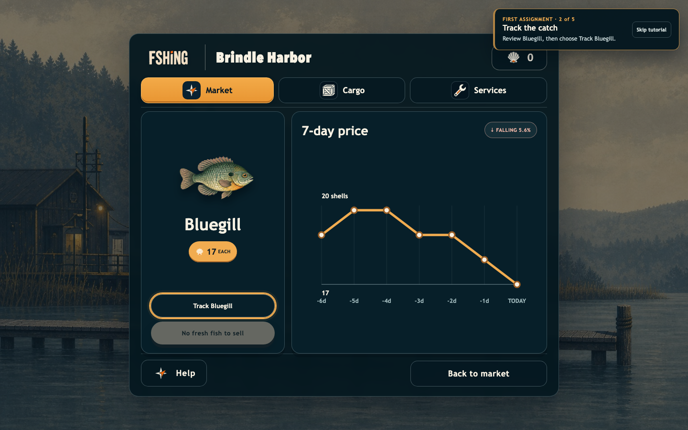
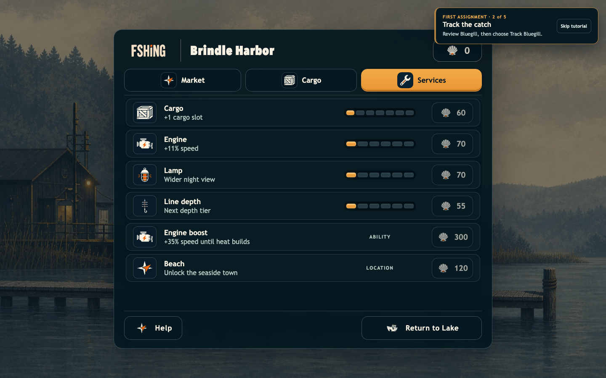
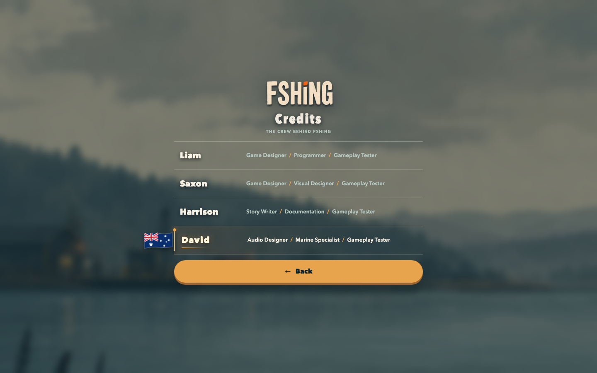
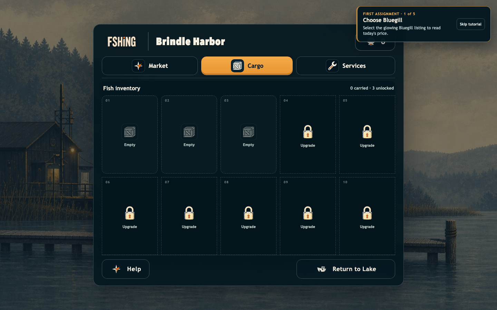
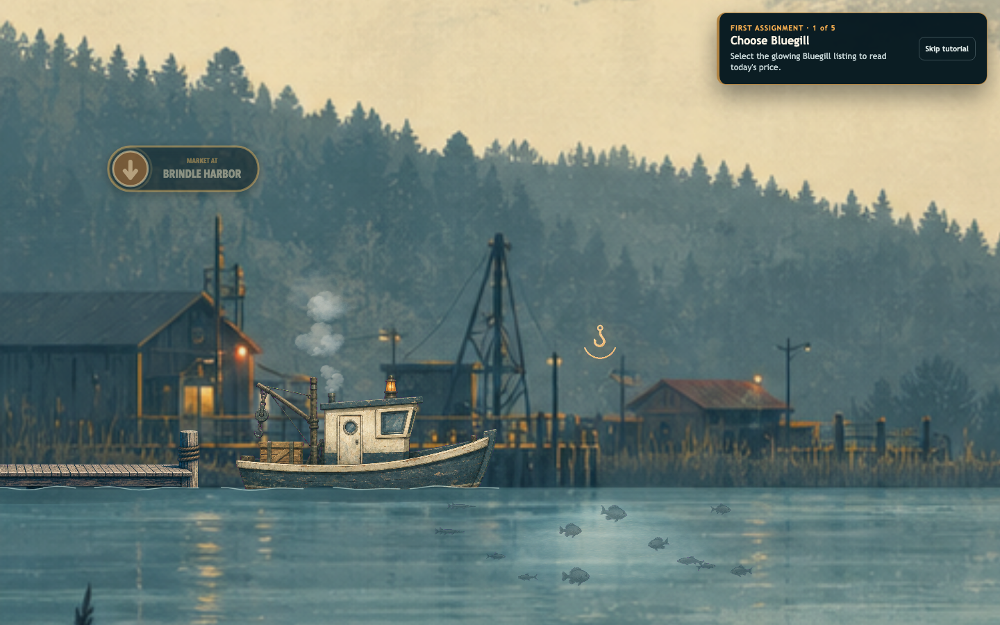
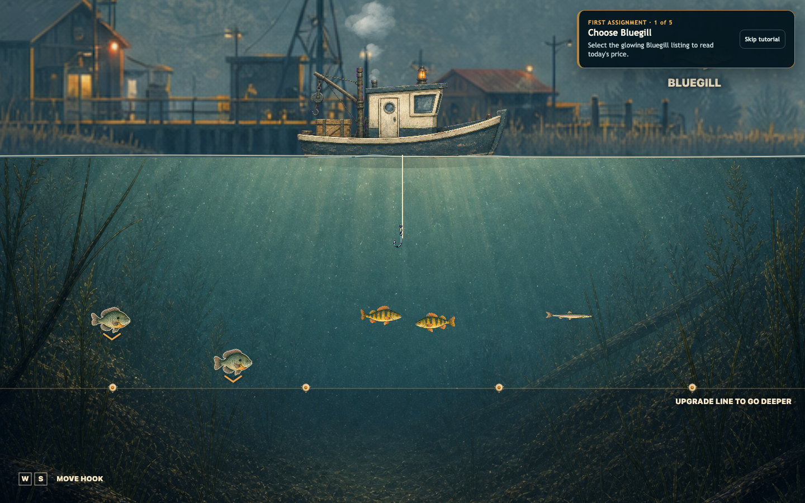

# FSHING

## Assessment 3 — Game Design and Development Portfolio

**Project:** FSHING, original browser game  
**Team:** Liam, Saxon, Harrison, David  
**Version documented:** 0.8.0 (PR #115)
**Document date:** 22 August 2026
**Submission components:** This report, source repository, and production build

---

## 1. Executive summary

FSHING is a side-on fishing market game. The player runs a working boat across a lake that spans several camera widths, later unlocking a second coastal map. At each harbor a live board lists today's quotes. The player tracks a species, sails to its habitat, drops a line, and sells the catch at the stronger market. The two harbors do not pay the same price, so the crossing itself is the trading decision.

The game teaches by consequence rather than a quiz. A deeper line reaches more valuable fish, while a larger cargo hold makes each trip more productive. Tracking one listing turns the lake into a route between a fishing ground and the stronger market.

The completed vertical slice contains:

- one lake and one unlockable Beach, each with two harbors and three fishing grounds
- eighteen real species (nine freshwater, nine south-eastern Australian coastal)
- cargo, engine, line, and five-tier reel-power upgrades, plus a rechargeable boost and Beach access; Beach middle/right grounds require line tiers 3/4
- deterministic reel-and-release fish fights with line tension, fish stamina, rarity scaling, and break recovery
- seeded daily quotes, seven-day history, and full-quote sales
- a five-step First Assignment, four-card How to play, credits, and an eight-sale season report
- keyboard sailing and hook steering, pointer/touch menus, remappable controls, mute, high contrast, reduced motion, and pause on focus loss
- deterministic gameplay tests, browser interaction tests, and version 12 validated saves

Product numbers and acceptance checks live in `Docs/Game-Brief.md`.

## 2. Purpose and intended audience

### Game purpose

Give the player a short, readable trading loop: read a market, catch a real species in a habitat that matches it, and choose where to sell it.

### Player outcomes

By the end of a season of eight sales, a player should be able to:

1. tell the three lake habitats apart and name at least one resident of each
2. use the seven-day graph to decide whether to sell today or wait
3. compare Brindle Harbor and Gloam Ferry instead of always selling at the nearest dock
4. spend shells on cargo, speed, or depth with a reason
5. recover from a full hold or an accidental release without restarting

### Target audience

Primary: Year 7–10 students and casual browser players who like collection, upgrades, and short objectives. Secondary: players on CrazyGames who need the game to boot without an SDK and remain usable on a keyboard or a touch menu.

A first run does not assume specialist vocabulary. First Assignment names the Bluegill, the Sunward Shoal, and the sell action in plain language. During the catch the tutorial title switches between holding in a lull and letting a racing fish run, and a toast appears if the player horses a run.

### User needs

| User need | Design response |
| --- | --- |
| Know what to do next | First Assignment highlights, canvas destination badge, live navigation status |
| Understand the market | Species card, current quote, trend, seven-day graph |
| Recover from mistakes | Cargo release with undo, skippable tutorial, rescue if hull damage ever reaches 100 |
| Recognise fish without colour | Distinct swim silhouettes, names, rarity outlines, depth gates |
| Use different devices or needs | Keyboard gameplay, pointer/touch menus, remapping, high contrast, reduced motion, mute |

## 3. Research, inspiration, and originality

Fishing-collection games typically progress through equipment, a catalogue, and deeper water. FSHING keeps that skeleton and replaces the catalogue-as-pokedex with a two-harbor market: the interesting choice is where and when to sell, not which quest to accept.

The project does not copy another game's protagonist, title treatment, fish names, silhouettes, art, animations, interface, map, prices, or source. Lake species are real North American freshwater fish. Beach species are real south-eastern Australian coastal fish. The original-art record is `Docs/Asset-Manifest.md`.

## 4. Gameplay design

### Core loop



### First-player journey

1. Press **Play**. The boat is already docked at Brindle Harbor.
2. First Assignment highlights Bluegill. Open it, read today's quote, then **Track Bluegill**.
3. Return to the lake. The badge reads **FISH AT Sunward Shoal**.
4. Slow under the shoal until the hook cue appears, then drop the line.
5. Steer onto a Bluegill. Hold left click while it is calm to gain ground, then release when it races away so the line can slacken. Background fish keep swimming in a subdued silhouette so the hooked fish remains the focus. The landed catch enters cargo and remains sellable.
6. Guidance switches to **SELL AT** whichever harbor currently pays more.
7. Dock, open Bluegill, sell. Shells land, the assignment completes, and prices will change when the next 210-second day begins.

### World

| Site | Region | Lake line | Beach line | Lake residents | Beach residents |
| --- | --- | --- | --- | --- | --- |
| Sunward Shoal | Brindle Coast | T0 | T0 | Bluegill, Yellow Perch, Emerald Shiner, White Sucker | Sea Mullet, Yellowfin Bream, Sand Whiting |
| Mosswater Pool | Mosswater Reach | T1 | T3 | Northern Pike, Largemouth Bass, Bowfin | Dusky Flathead, Luderick, Eastern Australian Salmon |
| Outer Gloam | Violet Gloam | T3 | T4 | Lake Trout, Burbot, Lake Sturgeon | Snapper, Yellowtail Kingfish, Mulloway |

Beach reuses the same spot names and world X positions. Reloading always restores the lake at Brindle; world, cargo, and time of day are not saved.

### Progression

| Purchase | Effect |
| --- | --- |
| Cargo (7 tiers, 3→10 slots) | Carry more before docking |
| Engine (6 tiers) | Faster crossings between fishing grounds and harbors |
| Line (6 tiers) | Reach deeper bands; Beach middle/right require tiers 3/4 |
| Reel power (5 tiers) | Reel 12% faster per tier, up to 1.60× speed |
| Engine boost (250 shells) | Hold Boost for a short overclock that overheats |
| Beach (300 shells) | Travel to the coastal map |

### Feedback

- Market cards show price, cargo count, and a tracking mark
- Fishing grounds read as faint schools, then a polarized lens, then a hook only inside the true interaction radius
- Depth-locked fish stay visible and dimmed under a labelled line limit
- Sales use a named popup (`Sold, N fish`) plus a tone
- Night uses a moon indicator as well as the darkened panorama

## 5. Algorithms and computational thinking

### Decomposition

```text
main.ts                  startup and dependency wiring
Game.ts                  lifecycle and HTML overlays
simulation.ts            deterministic gameplay state and rules
balance.ts               units, prices, fish, sites, regions
market.ts                quotes, history, sale payouts
marketView.ts            market HTML
renderer.ts              Canvas drawing only
input.ts / controls.ts   browser input → game intent
saveGame.ts              version 12 validation and migration
platformService.ts       only CrazyGames SDK boundary
feedbackService.ts       synthesized audio and haptics
```

Fishing presentation, camera, panorama, steam, and the destination badge are separate modules so `renderer.ts` does not own motion rules.

### Market quote

Each harbor/species/day price is hashed from the simulation seed (7), then stepped at most 6% from the previous day. Harbor demand, a scarcity factor, a small weather factor, and a slow cycle all multiply the species' whole-fish value. Every sold catch pays the displayed quote:

```text
payout ← quote
```

### Fishing spawn

A site spawns every resident. Count per resident follows that day's availability: 3 abundant, 2 normal, 1 scarce. Hook contact within radius 0.058 on a reachable depth starts a deterministic fight with an immediate, smoothly ramped 0.65 s escape run before the first lull. Holding left click, touch, or the Reel key during a lull gains ground and cools the line slightly; only an active run or thrash can increase tension. Releasing during a run lets the fish take line, which drops tension. Tension is read from the hook line colour and thickness rather than a corner meter. Non-hooked fish keep swimming, fade into subdued silhouettes, and lose their targeting cues during the fight. Free-swimming and hooked fish use bounded velocity and continuous steering rather than position impulses. Rarity supplies base difficulty while a researched profile gives each species its own run cadence, direction, depth bias, endurance, and body action; the source record is `Docs/Fish-Behaviour-Research.md`. Sustained critical tension breaks the line without ending the fishing session, while a completed fight uses a 1.15 s landing transition and stores the catch in cargo.

Sunward Shoal is the forgiving introduction: Bluegill, Yellow Perch, and Emerald Shiner have weak enough line loads to survive a continuous reel, while later habitats require the intended reel-and-release response.

### Determinism

Gameplay uses a fixed `1/120`-second step. Target positions and speeds come from a seeded random source. The same initial state, seed, input sequence, and time step produce the same result.

### Save validation

Save version 12 treats stored data as untrusted. Money, upgrade tiers, volume, and counters are clamped. The new Reel power tier defaults to zero for older saves and is capped at five. Species ids are filtered against the real list; retired fantasy ids migrate one-to-one. Duplicate discoveries are removed. The retired Outer permit field is ignored, while saved line tiers are preserved and now solely determine Outer Gloam access. Beach access defaults off. Malformed JSON becomes a valid new save. World, cargo, and clock are not persisted.

## 6. Interface and accessibility design

### Visual hierarchy

The title is a centred panel. **Play** is the largest action. Settings and Credits are secondary. The harbor is a dock-side sheet:

1. harbor name and shell balance
2. Market / Cargo / Upgrades
3. Help and Return to Lake (or Beach)

Market catalogue is a scrollable grid of nine cards. Detail is a focused view: art, price, Track, Sell, and the graph.

### Colour

Deep teal structure, sea-glass water, warm ivory copy, muted amber for actions. Colour is redundant: fish have names and silhouettes, locked cards have a `?`, depth locks have text, sales have a checkmark popup.

### Input and inclusion

- Keyboard navigation and gameplay
- Remappable bindings with collision-safe swapping
- Pointer and touch for menus, dock, and the fishing cue
- No on-screen movement pads
- Pause on focus loss or a hidden tab
- High contrast and reduced motion
- Mute and volume
- Local fallback when the CrazyGames SDK is blocked

## 7. Assets and design plans

Art direction is restrained gouache/screen-print scenery, deep teal interfaces, and high-readability side silhouettes. Runtime files are explicitly imported so authoring files in `output/imagegen/` do not enter `dist/`.

Lake and Beach each have a 3×3 UI atlas and three 4-frame swim sheets. The original 2×2 `fish-atlas.png` remains only for the fishing-hook cell. Prompts, sizes, and roles are in `Docs/Asset-Manifest.md`.

### Procedural audio

No audio file is bundled. `FeedbackService` synthesises tones and optional vibration.

| Cue | Purpose | Non-audio equivalent |
| --- | --- | --- |
| Engine | Speed through pitch and gain | Boat movement and wake |
| UI / cast | Confirm a press or a dropped line | Focus state; hook entering water |
| Catch / sale / upgrade | Distinguish success types | Toast, popup, changed values |
| Collision / deny | Damage or a blocked action | Toast and disabled copy |
| Dock | Arrival | Harbor overlay |

Mute and volume drive master gain. Vibration is never required to understand state.

### Implemented visual evidence

Captures in `Docs/screenshots/` were taken from the current build on 21 August 2026.

| Title | Fish market |
| --- | --- |
|  |  |

| Market detail | Upgrades |
| --- | --- |
|  |  |

| Credits | Cargo |
| --- | --- |
|  |  |

| Sailing | Underwater fishing |
| --- | --- |
|  |  |

Surface fishing grounds use a faint school, then a polarized lens, then a hook cue inside the interaction radius (`screenshots/09-fishing-cue.png`).

## 8. Testing and iteration

### Stakeholder feedback that is still visible in the build

| Feedback | Response still in the game |
| --- | --- |
| Larger map | Camera view width 0.30, so the harbor span is about three views |
| Normal menu | Centred title panel, dominant Play, Settings and Credits |
| Fishing spots should feel alive | Resident schools, polarized lens on approach, hook only inside the interaction radius |
| Lots of fish | Eighteen named real species with distinct swim gaits |
| Water deeper only with upgrades | Six line tiers and a labelled underwater boundary |
| Larger boats / more upgrades | Seven cargo tiers, six engine/line tiers, five reel-power tiers, boost, Beach |
| Different worlds | Lake and Beach palettes, piers, underwater plates, and fish sets |

Delivery contracts, water surveys, and the field guide were removed from the player-facing loop after the market replaced jobs. The unused delivery-contract route helpers have also been deleted; only survey helpers remain for tests and must not be treated as live UI.

### Automated test strategy

Unit/model tests cover:

- map scale, movement, facing, braking, speed, bounds, and determinism
- fishing targets, catch radius, reel progress, tension breaks, fish stamina, line strength, cargo capacity, and depth gates
- market quotes, harbor demand, full-quote payouts, and Beach premiums
- First Assignment, cargo release/restore, Beach travel, boost heat, season completion
- night fade, destination-badge layout, fishing presentation and reeling
- save corruption, fantasy-species migration, clamping, and round-trip persistence

Browser tests cover:

- title, credits, settings, remapping, pause, high contrast, reduced motion, SDK fallback
- First Assignment inspect → track → catch → sell → reload
- market grid, locked cards, cargo counts, Beach coastal art
- dock day/night plates, waterline transitions, night indicator
- fishing dive, reel-and-release fights, landing, Escape-to-surface, habitat-specific species
- four-step How to play
- absence of mobile movement pads and of the field guide

### Automated verification record

Local verification on 22 August 2026:

| Check | Result | Evidence |
| --- | --- | --- |
| Typecheck and unit/model suite | Pass | Strict TypeScript passed; 144 of 144 Vitest tests passed |
| Production build | Pass | Vite transformed 78 modules and produced `dist/` |
| Browser suite and SDK fallback | Pass | 36 of 36 Playwright tests passed; the suite aborts CrazyGames and still completes local play |

Typecheck, production build, and the Playwright suite should be run before merge (`npm run check`, `npm run build`, `npm run test:e2e`).

### Human playtest protocol

Automated tests prove states, not whether a new player understands the market. The script below is ready for at least three testers who have not seen the project. Blank cells are not invented evidence.

| Measure | Method | Success target | T1 | T2 | T3 |
| --- | --- | --- | --- | --- | --- |
| First Assignment completion | Observe without verbal help | 3/3 complete | — | — | — |
| Time to first sale | Stopwatch | Under 4 minutes | — | — | — |
| Harbor choice | Ask why they sold where they did | 2/3 mention price | — | — | — |
| Control errors | Count wrong or unclear actions | No repeated blocker | — | — | — |
| Readability | Toggle contrast and reduced motion | All information remains available | — | — | — |
| Enjoyment | 1–5 plus reason | Mean at least 3.5 | — | — | — |

## 9. Reflection and evaluation

### What is effective

The market replaced a contract checklist with a choice the player can repeat: which fish to target, which harbor pays more, and whether to sell now or watch another market day. Tracking a listing gives the lake a destination without a quest log.

Splitting market math, fishing motion, and overlays kept the loop testable. Quotes can be checked without Canvas. Swim gaits can be checked without the harbor HTML.

The interface now has one dominant action per screen. Locked cards, depth limits, and sale popups all have text.

### Challenges and solutions

**Challenge: jobs taught a single prescribed route.**  
Solution: First Assignment still forces one Bluegill sale, then the board opens. Tracking, not a contract, drives the destination badge.

**Challenge: two maps could strand a save.**  
Solution: Beach is a paid unlock, travel happens from a dock, and reload always returns to the lake at Brindle.

**Challenge: nine fantasy silhouettes were not enough once Beach shipped.**  
Solution: two real-species atlases and six swim sheets, with fantasy ids migrated in validated saves.

**Challenge: a market choice disappears if both harbors pay the same.**
Solution: per-harbor demand and a 6% daily cap keep the two quotes distinct while making every displayed price trustworthy.

### Limitations

- Season report copy still says "Research season complete" from an earlier STEM framing.
- Help card 1 says the player can compare both harbors on one card; the detail view shows only the docked harbor. The other quote is seen by docking there, or inferred from the sell badge.
- Fish within the same rarity share a fight profile, so species-specific fight personalities remain limited.
- Time, cargo, and world are not saved, so a refresh is always morning at Brindle.
- The human playtest table is pending.

### Realistic next steps

1. Run the documented playtest and fix the two most frequent issues.
2. Persist world, cargo, and clock, or tell the player that they reset.
3. Show both harbor quotes on the detail card so help text matches the UI.
4. Retitle the season report to match the market loop.
5. Decide whether leftover survey helpers should be deleted or re-exposed.

## 10. Rubric evidence map

| Rubric criterion | Evidence in this submission |
| --- | --- |
| Game purpose | Sections 1–2; playable market and habitat grounds |
| Target audience | Section 2; First Assignment, short loop, accessibility |
| Gameplay mechanics | Section 4 and `Docs/Game-Brief.md` |
| Design plans and assets | Sections 6–7; `Docs/Asset-Manifest.md` |
| Algorithms | Section 5; market quote, spawn counts, determinism, save validation |
| Computational thinking | Decomposed modules, seeded tests |
| User-centred design | User-needs table, hierarchy, accessibility |
| Testing and iteration | Section 8; 144 unit tests, 36 browser tests, honest playtest protocol |
| Functional game | Onboarding-to-sale loop, Beach, upgrades, persistence |
| Reflection | Section 9 |

## 11. Final submission checklist

- [ ] Replace the human-playtest blank cells with real observations.
- [x] Keep `Docs/Game-Brief.md` aligned with the playable loop.
- [x] 144 unit/model tests pass.
- [ ] Run `npm run check`, `npm run build`, and `npm run test:e2e` on the submission machine.
- [x] Confirm CrazyGames SDK failure still falls back locally (browser suite aborts the SDK).
- [x] Confirm a refresh retains money, unlocks, discoveries, and tutorial completion.
- [x] Capture current screenshots of title, market, detail, upgrades, credits, cargo, sailing, and fishing.
- [ ] Export this report to the teacher's required format.
- [ ] Submit the report and ZIP or hosted link before the deadline.
