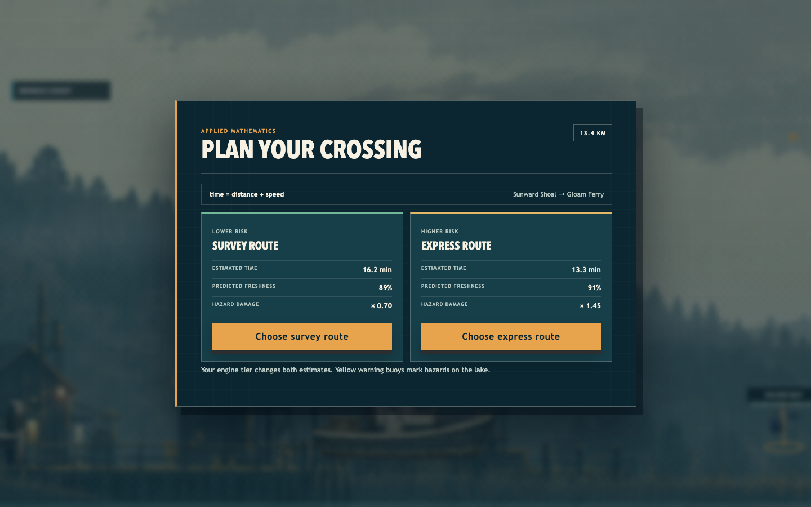
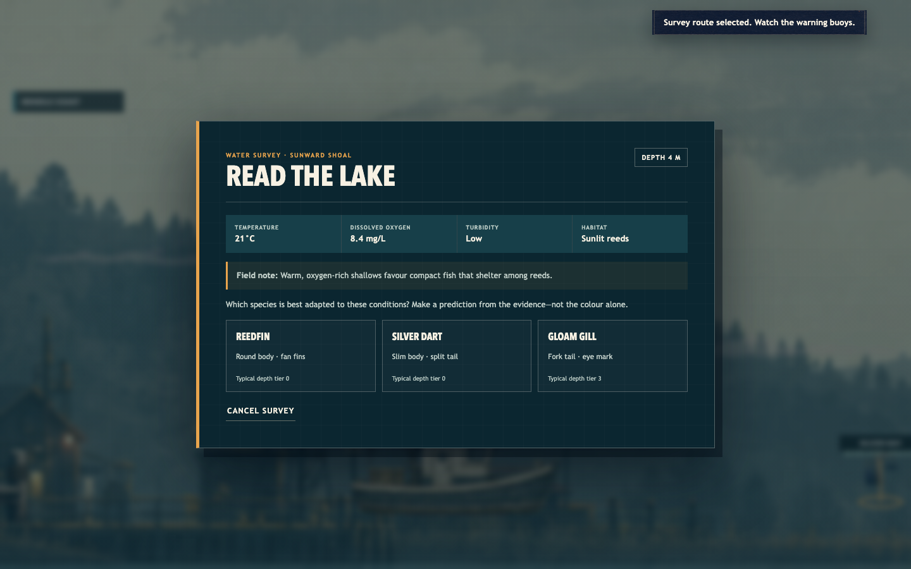
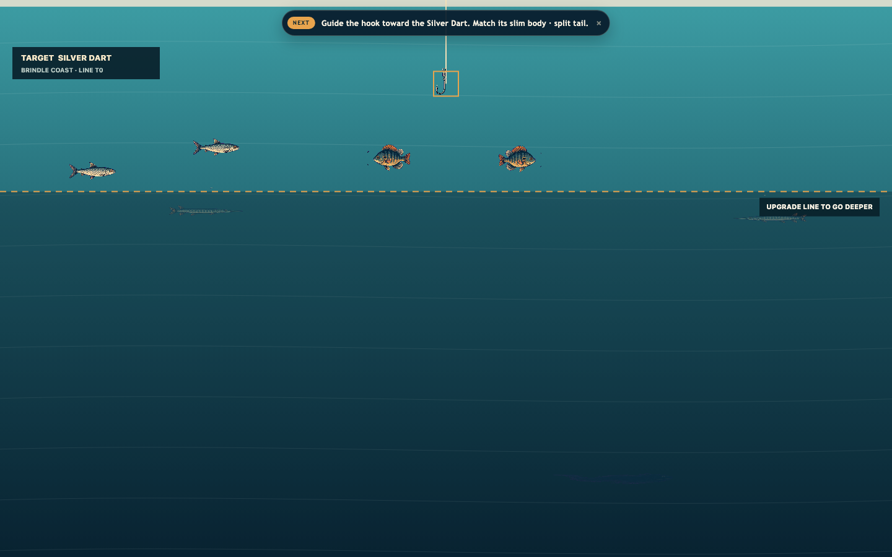

# FSHING

## Assessment 3 — Game Design and Development Portfolio

**Student:** Saxon Rigg-Smith  
**Project type:** Original browser game  
**Submission components:** This report, source repository, and production build  
**Document version:** 1.0 — 31 July 2026

---

## 1. Executive summary

FSHING is an original side-on environmental-science fishing and delivery game. The player operates a research boat across a lake that spans several camera widths. At each site, the player reads depth, temperature, dissolved oxygen, turbidity, and habitat evidence, predicts which fish is adapted to those conditions, and then tests the prediction by fishing underwater. A delivery requires a second STEM decision: compare distance, travel time, predicted freshness, and hazard risk before choosing a survey or express route.

The game teaches through cause and effect. Habitat readings and fish adaptations guide each catch, while travel speed determines how much freshness reaches the destination. After eight deliveries, a season report asks the player to evaluate their evidence, survey accuracy, and route decisions.

The completed vertical slice contains:

- one continuous lake across approximately three landscape camera widths;
- two harbors, three ecosystem regions, three widely separated fishing sites, and three visible hazards;
- nine original fish with different silhouettes, habitat profiles, values, and depth tiers;
- four upgrade paths with six tiers each and seven visible boat classes;
- water surveys, route mathematics, freshness, contracts, hazards, cargo release, and a mastery report;
- keyboard gameplay controls and pointer/touch interface actions;
- mute, volume, high-contrast, reduced-motion, remappable controls, and pause on focus loss;
- deterministic gameplay tests, browser interaction tests, and versioned validated saves.

## 2. Purpose and intended audience

### Game purpose

The game’s learning purpose is to let players practise scientific reasoning inside a short, understandable game loop. Players do not receive a fact sheet and then answer a disconnected quiz. They observe evidence, make a prediction, act on it, and compare the result with their model.

### STEM learning outcomes

By the end of a research season, a player should be able to:

1. interpret common water-quality measurements as connected environmental evidence;
2. explain how fish body shapes and sensory features can suit a habitat;
3. calculate or compare journey time using `time = distance ÷ speed`;
4. explain a speed–freshness–risk trade-off;
5. use habitat evidence to predict which species belongs at a fishing ground;
6. revise a prediction after receiving evidence-based feedback.

### Learning-to-gameplay alignment

| STEM outcome | Gameplay action | Immediate feedback | Measurable evidence |
| --- | --- | --- | --- |
| Interpret water-quality evidence | Follow a living shoal, then read depth, temperature, oxygen, turbidity, and habitat at its fishing ground | Written field note links the readings | Survey completed; selected prediction stored |
| Connect adaptation to habitat | Choose one contract species from three silhouettes and descriptions | Supported/rethink result explains the fish feature | Correct predictions and field-guide discovery |
| Apply distance–speed–time | Compare catch-to-harbor route distance and two calculated times | Both estimates show the same equation and units | Route-plan count; chosen route stored |
| Evaluate a risk trade-off | Choose safer/slower or faster/higher-damage travel | Route card and hazard hit report show multipliers | Predicted versus actual freshness result |
| Revise a model | Read an explanation after any prediction, then fish in that habitat | Incorrect answers remain playable and reveal the supported species | Accuracy across the eight-delivery season |

### Target audience

The primary audience is Year 7–10 students. The secondary audience is casual browser-game players who enjoy collection, upgrading, vehicle movement, and short objectives. A first contract is designed to be understandable without specialist vocabulary: every measurement has a plain-language clue, numerical units remain visible, and feedback explains the relevant adaptation.

### User needs

| User need | Design response |
| --- | --- |
| Know what to do next | One dominant action, contextual prompts, destination arrow, numbered contract steps |
| Understand why an answer is right | Immediate written explanation connecting measurements, habitat, and adaptation |
| Learn without a punishing quiz | Incorrect predictions still reveal evidence and allow play to continue |
| Recognise fish without colour | Distinct silhouettes, shape descriptions, names, and depth tiers |
| Manage limited cargo | Release an unneeded catch at harbor to free a slot |
| Recover from mistakes | Rescue keeps the save and contracts remain repeatable |
| Use different devices or needs | Keyboard gameplay, pointer/touch interface actions, remapping, high contrast, reduced motion, mute |

## 3. Research, inspiration, and originality

I analysed fishing games at the level of general design patterns. The official *Cat Goes Fishing* store description demonstrates a clear progression from simple equipment to different fish, quests, boats, deeper water, and a catalogue. FSHING transforms those abstract patterns into a scientific evidence loop: survey water, predict a species, plan a route, and evaluate results. [Official Steam listing](https://store.steampowered.com/app/343780/Cat_Goes_Fishing/)

The project does **not** copy another game’s protagonist, title treatment, humour, fish names, silhouettes, art, animations, interface, map, dialogue, prices, balance curve, source code, or data. Every FSHING species, ecosystem, visual prompt, rule, and line of implementation was produced for this project. The original-art record is maintained in `Docs/Asset-Manifest.md`.

The Australian Copyright Council distinguishes an abstract idea from its protected expression and also identifies computer programs as protected works. I used a stricter practical boundary: analyse genre patterns, then independently design all expression and implementation. [Ideas: Legal Protection](https://www.copyright.org.au/browse/book/ACC-Ideas%3A-Legal-Protection-INFO015) · [Games & Copyright](https://www.copyright.org.au/browse/book/ACC-Games-%26-Copyright-INFO016)

## 4. Gameplay design

### Core loop


### First-player journey

1. Press **Play** and arrive at Brindle Harbor.
2. Accept **The Morning Order**, which requests a Bluegill for Gloam Ferry.
3. Follow the faint Sunward Shoal fish activity until the polarized-water lens strengthens and the hook appears above the fishing ground.
4. Read: 4 m, 21°C, 8.4 mg/L dissolved oxygen, low turbidity, sunlit reeds.
5. Predict the Bluegill from three species descriptions.
6. Read why broad fins help it manoeuvre in reeds, then lower the hook.
7. Catch the Bluegill. Its freshness begins at 100%.
8. Compare two routes from the catch site to Gloam Ferry. The screen displays distance, estimated minutes, predicted freshness, and hazard multiplier.
9. Select a route and cross the lake, using visible yellow hazard signs and braking when needed.
10. Dock, deliver, and compare the catch-to-harbor prediction with actual freshness.
11. Spend the reward on a larger boat, engine, lamp, or line depth.
12. Review the confirmed species and survey results in the season report.

### World and scientific progression

| Site | Region | Readings | Habitat residents | Required line |
| --- | --- | --- | --- | ---: |
| Sunward Shoal | Brindle Coast | 4 m, 21°C, 8.4 mg/L, clear reeds | Bluegill, Yellow Perch, Emerald Shiner | T0 |
| Mosswater Pool | Mosswater Reach | 8 m, 19°C, 6.4 mg/L, vegetation/debris | Northern Pike, Largemouth Bass, Bowfin | T1 |
| Outer Gloam | Violet Gloam | 31 m, 8°C, 5.5 mg/L, rocky drop-off | Lake Trout, Burbot, Lake Sturgeon | T3 + permit |

Each fishing view contains two individuals from each of its three documented residents. A later contract can request any resident of its assigned site; the survey then evaluates that contract target instead of silently reverting to the site's primary species.

### Progression and upgrades

| Upgrade | Six-tier effect | Player decision |
| --- | --- | --- |
| Boat and cargo | One more space per tier; Skiff → Lakebreaker | Carry more, but spend money that could improve speed or depth |
| Engine | 11% speed increase per tier | Better freshness and estimates, but express travel still raises hazard damage |
| Lamp | Larger readable area at night | Safer information versus immediate earning upgrades |
| Line depth | Reaches the next visible underwater band | Opens rarer fish and new scientific conditions |
| Outer Gloam permit | Access to the two outer sites | Invest in exploration after equipment is ready |

### Feedback and reward

- Survey feedback names whether evidence supported the prediction and explains the relationship.
- Underwater depth boundaries remain visible with an upgrade instruction.
- Fishing grounds remain faintly discoverable through GPT Image school sprites; proximity reveals a GPT Image polarized-water lens and interaction-range hook cue.
- Hazards use a shape, `!` symbol, written name, and colour.
- Delivery results compare prediction and actual outcome instead of showing only currency.
- The season report displays four measurable outcomes and includes reflection questions.

## 5. Algorithms and computational thinking

### Decomposition

The program separates responsibilities:

```text
main.ts                  startup and dependency wiring
Game.ts                  high-level lifecycle and HTML overlay coordination
simulation.ts            deterministic gameplay state and rules
stem.ts                  water evidence, species profiles, surveys, route estimates
balance.ts               central units, prices, fish, sites, regions, hazards
renderer.ts              Canvas drawing only; never changes simulation state
input.ts                  browser input → game intent
saveGame.ts              versioning, validation, clamping, migration
platformService.ts       only CrazyGames SDK boundary
feedbackService.ts       audio/haptic feedback
```

### Survey algorithm

```text
FUNCTION recordSurvey(site, prediction, contractTarget)
  expected ← contractTarget IF contractTarget is a documented site resident
             ELSE site.primarySpecies
  surveysCompleted ← surveysCompleted + 1
  IF prediction = expected
    correctPredictions ← correctPredictions + 1
  ENDIF
  discoveredSpecies ← UNIQUE(discoveredSpecies + expected)
  RETURN explanation(site.measurements, expected.adaptation)
END FUNCTION
```

### Route algorithm

```text
distanceKm ← ABS(destinationHarborX - catchSiteX) × 18
engineFactor ← 1 + engineTier × 0.11
safeSpeed ← 0.05 × 0.92 × engineFactor × 18
fastSpeed ← 0.05 × 1.12 × engineFactor × 18
safeMinutes ← distanceKm ÷ safeSpeed
fastMinutes ← distanceKm ÷ fastSpeed
predictedFreshness ← MAX(0, 100 - minutes × 0.667)
safeHazardDamage ← baseDamage × 0.70
fastHazardDamage ← baseDamage × 1.45
```

The estimate begins when the requested fish is caught, exactly when freshness begins to fall. One scaled in-game second is treated as one model minute, so predicted time and measured delivery time share the same distance, maximum-speed, and freshness rules. Slower steering, braking, or detours can therefore explain a lower actual result.

### Determinism

Gameplay uses a fixed `1/120`-second simulation step. Random target positions and speeds come from a seeded random source. The same initial state, seed, input sequence, and time step therefore produce the same result. Determinism makes bugs reproducible and tests reliable.

### Save validation

Save version 9 treats stored data as untrusted. Money, upgrade tiers, learning counters, volume, and other numerical values are checked and clamped. Species identifiers are filtered against the real species list, retired fantasy identifiers migrate one-to-one, duplicate discoveries are removed, obsolete population fields are ignored, and malformed JSON falls back to a valid new save.

## 6. Interface and accessibility design

### Visual hierarchy

The menu was revised from a stylised arrangement into a conventional centred panel. **Play** is the largest action. How to play, Field guide, and Settings are clearly secondary. The harbor uses a consistent dispatch-sheet structure:

1. current task and reward;
2. numbered catch/freshness/destination steps;
3. cargo;
4. upgrades and services;
5. return to lake.

Science overlays use the same hierarchy: heading, measurements, evidence clue, decision, feedback, next action.

### Colour system

- deep teal: background and primary structure;
- lighter teal and sea-glass: regions and neutral information;
- warm ivory: readable text;
- muted amber: actionable or caution information;
- restrained green/yellow/coral: supported and warning states.

Colour is redundant. Hazards include a symbol and name. Fish use names and silhouette descriptions. Buttons have focus outlines, and depth locks include text.

### Input and inclusion

- Keyboard navigation and gameplay controls
- Remappable action bindings with collision-safe swapping
- Pointer and touch interface actions with large targets
- Pause on focus loss or hidden tab
- High-contrast mode
- Reduced-motion mode
- Mute and volume
- No essential audio-only or colour-only information
- Local fallback when the external SDK is unavailable

## 7. Assets and design plans

The art direction uses original restrained gouache/screen-print scenery, deep teal interfaces, and high-readability side silhouettes. Runtime assets are explicitly imported so authoring files do not accidentally enter the production build.

The nine-fish 3 × 3 atlas was generated specifically for FSHING. Its row-major layout matches typed fish data, so each fish maps to one deterministic cell. The original two-by-two atlas remains only for its fishing-hook cell. Exact prompts, sizes, roles, source/reference images, runtime paths, and originality notes are in `Docs/Asset-Manifest.md`.

### Procedural audio and equivalent feedback

No external audio file is copied or bundled. `FeedbackService` creates short Web Audio tones/noise and optional device vibration at runtime.

| Cue | Procedural implementation and purpose | Non-audio equivalent | Status |
| --- | --- | --- | --- |
| Engine | Filtered triangle oscillator changes pitch and gain with speed | Boat movement and wake state | Implemented |
| UI/cast | Short sine sweep; filtered noise plus descending tone | Focus/pressed state; hook visibly enters the water | Implemented |
| Catch/delivery/upgrade | Rising triangle/sine patterns distinguish success types | Named toast, flash, result panel, changed values | Implemented |
| Collision/deny | Low sawtooth/noise impact or descending square tone | Hazard symbol/name, damage toast, denial text | Implemented |
| Dock | Two restrained descending triangle tones | Harbor overlay and dock state | Implemented |
| Accessibility controls | Master gain follows saved mute and volume; vibration is optional | Every cue has text, motion, shape, or state feedback | Implemented |

Important design decisions:

- three fishing grounds are distributed across the lake and revealed through subtle shoal activity;
- each region has a different surface, shallow, middle, and deep palette;
- fish silhouettes differ in height, length, tail, fins, crest, lure, ray wings, or armour;
- deeper fish remain visible but dimmed below the labelled line limit;
- cargo-tier upgrades visibly enlarge the boat and rename its class.

### Implemented visual evidence

| Main menu | Route mathematics |
| --- | --- |
|  |  |

| Water-evidence prediction | Habitat-specific, upgrade-gated fish |
| --- | --- |
|  |  |


## 8. Testing and iteration

### Stakeholder feedback and resulting iterations

The development brief was refined through direct stakeholder requests:

| Feedback | Problem identified | Implemented response |
| --- | --- | --- |
| “Make it a much larger map” | The voyage felt too small | Camera view reduced to 0.30 world width, making the harbor span about three views |
| “Menu screen … a lot more normal” | Initial menu hierarchy was unusual | Centred bounded panel, dominant Play button, familiar secondary actions |
| “Fix the colour scheme” | Colours lacked cohesion | Unified deep teal, sea-glass, ivory, amber, and restrained warning colours |
| “Fishing spots should feel alive” | Large labelled landmarks felt artificial and cluttered the waterline | Full resident fish schools, a proximity-strengthened polarized-water lens, and a hook shown only inside the true interaction radius |
| “Lots of different types of fish” | Repeated fish did not support discovery | Nine named, illustrated, silhouette-distinct species and profiles |
| “Water deeper … only with upgrades” | Depth progression was unclear | Six visible depth tiers and labelled upgrade boundary |
| “Larger boats … upgrade way more” | Progression ended too quickly | Six tiers in four upgrade paths and seven named boat classes |
| “Different worlds … colour schemes” | Areas lacked identity | Three connected ecosystems with separate above/below-water palettes |
| Assignment needed a clear STEM purpose | Fishing loop alone did not demonstrate learning | Surveys, route mathematics, habitat evidence, explanations, and season evaluation |

### Automated test strategy

Unit/model tests cover:

- map scale, movement, facing, braking, speed, bounds, and deterministic state;
- fishing targets, catch radius, cargo capacity, depth gates, and permits;
- contracts, freshness, payments, upgrades, rescue, and progression;
- survey correctness, explanations, discoveries, and accuracy;
- contract-specific survey targets and habitat-specific fish spawning;
- cargo release and repeatable contract generation;
- route estimates, engine effect, and safe/fast hazard damage;
- season completion;
- save corruption, migration, clamping, learning records, and round-trip persistence.

Browser tests cover:

- the complete survey → fish → deliver → result → upgrade → reload flow;
- route choice and displayed equation;
- settings, remapping, pause, high contrast, reduced motion, and SDK fallback;
- six-step help navigation;
- absence of mobile button controls at responsive viewport sizes;
- horizontal keyboard movement and facing;
- removed field-guide menu and buttons.

### Automated verification record

Final local verification on 31 July 2026:

| Check | Result | Evidence |
| --- | --- | --- |
| Strict TypeScript | Pass | `tsc --noEmit` completed with zero errors |
| Unit/model suite | Pass | 23 of 23 Vitest tests passed |
| Production build | Pass | Vite transformed 25 modules and produced `dist/` |
| Browser suite | Pass | 6 of 6 Playwright Chromium tests passed |
| SDK-unavailable fallback | Pass | Browser suite blocks the CrazyGames SDK and completes local play |

### Human playtest protocol

Automated tests can prove correct states, but not whether a student understands or enjoys them. The following script is ready for at least three testers who have not seen the project. Results must be recorded honestly after testing; blank cells are not invented evidence.

An em dash means that a real participant result is still pending.

| Measure | Method | Success target | T1 | T2 | T3 |
| --- | --- | --- | --- | --- | --- |
| First contract completion | Observe without verbal help | 3/3 complete | — | — | — |
| Time to first survey prediction | Stopwatch | Under 3 minutes | — | — | — |
| Habitat explanation | Ask “Why did that fish fit?” | 2/3 cite a measurement + adaptation | — | — | — |
| Route reasoning | Ask why they chose safe/fast | 2/3 mention time and risk/freshness | — | — | — |
| Control errors | Count wrong/unclear actions | No repeated blocker | — | — | — |
| Readability/accessibility | Toggle contrast/reduced motion | All information remains available | — | — | — |
| Enjoyment | 1–5 rating plus reason | Mean at least 3.5 | — | — | — |

For each test, record the observation, not only the score. Convert each repeated issue into: severity, reproduction steps, change, and retest result.

## 9. Reflection and evaluation

### What is effective

The strongest decision was integrating learning into the same decisions that already make a fishing-delivery game interesting. Habitat evidence controls where the player fishes, while route mathematics controls travel. This is more effective than pausing the game for unrelated multiple-choice questions.

The deterministic architecture also improved quality. Rules can be tested without Canvas, audio, the DOM, or wall-clock time. Central balance values made the larger lake, six tiers, freshness, and hazard risk easier to revise without searching through interface code.

The interface now gives a clear progression of information and uses written non-colour feedback. The new atlas gives each species a recognisable identity. Visible but inaccessible deep fish create curiosity while the labelled boundary explains how to reach them.

### Challenges and solutions

**Challenge: expansion could make the game confusing.**  
Solution: use the same evidence-card structure at every survey, preserve one main action on each overlay, and place detailed information in the optional field guide.

**Challenge: a fast route was always the obvious choice.**  
Solution: make speed improve freshness but multiply hazard damage by 1.45, while the survey route reduces damage to 0.70.

**Challenge: the first diverse-fish prototype put every species at every site.**  
Solution: define three scientifically plausible residents per site, spawn two of each, and make later surveys follow the contract resident. This preserves a busy lake without contradicting the habitat evidence.

**Challenge: an early route forecast measured a different journey from the delivered catch.**  
Solution: open planning after the catch and calculate catch-site-to-destination time with the same maximum-speed and freshness model used by the simulation.

**Challenge: existing save files lacked new learning data.**  
Solution: use versioned migration, validate every field, and supply safe defaults. Version 9 preserves discovery progress while mapping all retired fantasy fish ids to their real-species replacements.

**Challenge: nine fish based on three atlas cells would not be genuinely distinct.**  
Solution: produce a new original 3 × 3 atlas and map each typed species to one cell.

### Limitations

The route display uses scaled in-game values rather than a real lake. These simplifications are acceptable for the audience only if the interface calls them route **estimates**, not real-world measurements.

Fish currently share a general swimming algorithm; silhouette, depth, and speed vary more than behaviour. The lamp primarily changes visibility rather than scientific sampling. Three hazards are fixed, so expert players can memorise them. Most importantly, the human playtest table is pending and must be completed before making claims about learning effectiveness.

### Realistic future improvements

1. Run the documented student playtest and revise the two most frequent issues.
2. Add deterministic environmental events such as a cold front or algal bloom that change readings and require a revised hypothesis.
3. Give fish behaviour rules linked to adaptation, such as schooling in clear water or holding position in a current.
4. Add an optional worked route calculation where players enter the time before comparing it.
5. Model food-web effects carefully, with visual explanations and new tests.
6. Improve soundscapes per ecosystem while retaining mute and visual warnings.
7. Add a downloadable season summary for teacher discussion, without collecting personal data.

## 10. Rubric evidence map

| Rubric criterion | Evidence in this submission |
| --- | --- |
| Game purpose and STEM learning | Sections 1–2; playable surveys, route maths, habitat evidence, season evaluation |
| Target audience | Section 2; scaffolded language, short loop, accessibility |
| Gameplay mechanics | Sections 4–5 and `Docs/Game-Brief.md` |
| Design plans and assets | Sections 6–7; `Docs/Asset-Manifest.md`; typed balance tables |
| Algorithms/pseudocode | Section 5; survey, catch/release, route, determinism, save validation |
| Computational thinking | Decomposed module architecture, abstraction, deterministic tests |
| User-centred design | User-needs table, hierarchy, iterative feedback table, accessibility |
| Testing and iteration | Section 8; automated suites plus honest human protocol |
| Functional and engaging game | Complete onboarding-to-upgrade loop, expanded progression, visible feedback |
| Reflection and evaluation | Section 9; strengths, challenges, limitations, realistic next steps |

## 11. Final submission checklist

- [ ] Replace the human-playtest “Pending” cells with real observations and retest notes.
- [x] Strict TypeScript and all 23 unit/model tests pass.
- [x] Create and verify the production build.
- [x] Pass all 6 Playwright Chromium tests.
- [x] Verify desktop interaction and responsive interface paths.
- [x] Confirm CrazyGames SDK failure still falls back locally.
- [x] Confirm a refresh retains field-guide and upgrade progress.
- [x] Capture final screenshots of title, survey, underwater depth, route plan, and field guide.
- [ ] Export this report to the teacher’s required format.
- [x] Create and integrity-check the clean game submission ZIP.
- [ ] Submit the report and ZIP or hosted link before the deadline.
