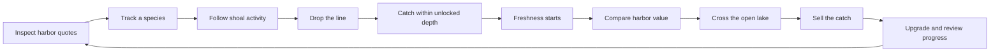

# FSHING — Game Design Document

## Project summary

**FSHING** is a single-player, side-on environmental-science fishing market game for web browsers. The player pilots a working boat along a horizontally scrolling lake, learns which species live in each ecosystem, catches fish at the appropriate depth, and decides when and where to sell the catch.

The lake is inviting during the day but becomes difficult after dark. Darkness and fog reduce visibility without placing fixed obstacles in the boat's path. Fish values change a little each market day and differ between the two harbors. Freshness falls in transit, so a distant high quote is only useful when the boat can reach it quickly enough. Profitable sales fund larger cargo holds, greater speed, stronger lights, deeper lines, and access to three visually and scientifically distinct regions.

After eight market sales, the player receives a season report summarising earnings, species discoveries, and trading activity. The loop remains playable afterward, while discovering all eighteen species across the lake and Beach, unlocking every region, and purchasing every upgrade provides longer-term mastery.

## Design pillars

1. **Fishing without interruption.** Activating a fishing ground drops the line immediately, with a player-tracked species identified in the underwater view.
2. **Travel time affects the sale.** Engine upgrades shorten crossings and help preserve the value of a catch.
3. **Habitats guide each catch.** Environmental readings, resident species, silhouettes, and depth bands make evidence-based targeting meaningful.
4. **Simple to start, satisfying to master.** Boat momentum and direct hook steering are immediate, while deeper lines, species knowledge, and efficient travel provide mastery.
5. **A broad lake with purposeful stops.** Three widely separated living fishing grounds, two harbors, three ecosystems, and six depth bands make the enlarged route readable without filling the waterline with signposts.
6. **Accessible evidence.** Shapes, numbers, labels, icons, and text repeat every important colour signal.

## Inspiration and originality

### Inspiration

*Dredge* informed the broad contrast between calm travel and risky darkness. *Cat Goes Fishing* was examined as a competitor because its clear equipment, exploration, species-discovery, and catalogue progression are easy to understand. FSHING retains only those abstract genre patterns and transforms them into an original environmental-science loop. No names, fish designs, dialogue, interface layouts, balance values, art, code, map, or behaviours were copied.

For the engine boost, mechanical research found that DREDGE's Haste is held for a temporary speed increase, builds engine heat while active, and dissipates heat after release; overheating damages an engine slot. Player timing tests estimate its immediate gain at roughly one third. FSHING adopts only the readable hold–heat–recover rhythm and approximate speed feel, replacing damage and panic with a forgiving cooling lockout suited to a short educational browser game.

### Points of originality

FSHING is not intended to reproduce Dredge in 2D. Its distinct focus is a small, readable fish market:

- The player chooses what to catch and where to sell it rather than following town quests.
- Two harbor quotes, daily movement, and freshness make boat speed and route choice central to profit.
- The fishing interaction involves directly steering a hook toward visible fish.
- Its compact lake and short catch-to-sale runs are designed for drop-in browser play.
- Progress comes from opening profitable fishing routes and mastering acceleration, momentum, and travel timing along a side-on lake.
- Horror is delivered through 2D visibility, sound, and environmental changes rather than a large story campaign.
- Habitat-specific resident sets, observable price history, travel-time feedback, and a season evaluation distinguish the learning purpose from either inspiration.

## Audience and platform

- **Platform:** Desktop and mobile web, distributed as a static CrazyGames HTML5 build.
- **Genre:** Side-scrolling fishing, market, and light survival game.
- **Mode:** Single-player.
- **Audience:** Year 7–10 students and casual players who enjoy accessible vehicle handling, collection, upgrades, and learning through short decisions.
- **STEM purpose:** Practise interpreting environmental measurements, matching adaptations to habitats, and applying distance–speed–time relationships.
- **Content tone:** Cozy during the day. Night sequences may become genuinely disturbing, but should avoid graphic violence and remain suitable for a broad browser-game audience.
- **Session pattern:** Continuous saved game with catch-to-sale runs that can usually be completed in approximately 3–8 minutes.

## Core gameplay loop

1. Visit a harbor and inspect the market board for every discovered species.
2. Compare today's local quote, recent price history, the other harbor's quote, and the fish's habitat.
3. Track a species, then pilot toward its fishing ground.
4. Drop the line and steer the hook toward that resident species.
5. Store the catch; freshness begins to fall and reduces its sale value.
6. Choose the nearby harbor or travel farther for a stronger quote while time, weather, and darkness change the trip.
7. Sell one species from the hold and receive an immediate itemised confirmation.
8. Spend the earnings on cargo, engine, lamp, line, and region upgrades, then repeat.

A poor trade should cost time and potential income, but should not erase the player's entire save. The player always has a low-risk recovery path through common fish near Brindle Harbor.

## STEM learning design

### Learning outcomes

After a complete research season, the target player should be able to:

1. Connect species availability and depth to the lake's distinct fishing-ground habitats.
2. Recognise fish through visible silhouettes and movement patterns rather than colour alone.
3. Observe how travel time and engine speed affect catch freshness.
4. Explain why a faster journey can preserve more freshness.
5. Use habitat evidence to predict which species belongs at each fishing ground.
6. Use freshness and payment outcomes to revise a travel decision.

Fishing begins immediately when the player activates an available ground; there is no blocking species quiz. The player-selected specimen note and target marker guide the catch, while habitat-specific resident sets and water readings keep the environmental-science context inside play. The season report retains discoveries, earnings, and market sales so progress is visible over time.

### Learning loop and feedback



Feedback uses three levels:

- **Immediate:** tracked-species marker, catch feedback, current quote, and navigation guidance.
- **After a sale:** an itemised notification confirms species, quantity, freshness adjustment, harbor, and shells earned without interrupting harbor play.
- **Across the season:** species discoveries, market earnings, sale count, and a reflection prompt.

### Computational thinking

- **Decomposition:** travel, fishing, markets, weather, rendering, input, persistence, and platform integration are separate responsibilities.
- **Pattern recognition:** each fishing ground has a stable resident set, allowing players to learn species silhouettes, movement patterns, and depth bands through repeated play.
- **Abstraction:** normalized horizontal position represents an 18 km lake; six line tiers represent depth bands.
- **Algorithms:** fixed-step movement, seeded target movement, clamped save migration, deterministic quote history, and freshness loss are deterministic.
- **Evaluation:** automated tests compare expected states; recent price history, freshness, and sale outcomes let the player evaluate a trading decision.

### Core pseudocode

```text
CATCH(species)
  IF cargo is full THEN reject catch
  cargo.add(species, freshness = 100)
```

```text
QUOTE(species, harbor, day)
  previous ← QUOTE(species, harbor, day - 1)
  dailyDemand ← SEEDED_VARIATION(species, harbor, day)
  conditionEffect ← LAKE_CONDITION(day, species)
  target ← species.baseValue × harborBias × dailyDemand × conditionEffect
  return CLAMP(previous moving toward target, maximum daily change = 6%)
```

```text
SELL(catch, harbor, day)
  unitQuote ← QUOTE(catch.species, harbor, day)
  freshnessFactor ← 0.25 + (0.75 × catch.freshness ÷ 100)
  payment ← ROUND(unitQuote × freshnessFactor)
  show sale confirmation for 4 seconds
```

## World structure

The game takes place along one connected side-on lake route divided into regions. The camera follows the boat horizontally while layered shore, sky, water, docks, and landmarks establish depth without 3D. The full lake should span at least three landscape view widths, making a cross-lake market run feel like a journey while keeping each stretch anchored by a harbor, fishing ground, boundary, or visible landmark.

### Region progression

- **Brindle Coast:** Warm blue-green water, calm weather, common surface fish, and short deliveries.
- **Mosswater Reach:** Green water, heavier vegetation, deeper fish, changing weather, and stronger currents.
- **Violet Gloam:** Cold violet water, poor visibility, disturbing events, and the rarest deep fish.

The connected surface route remains navigable, but each region has a distinct color treatment, named fishing ground, and resident fish set. Region tints use a low-opacity overlay and a wide feathered blend around each boundary, so travelling changes the atmosphere gradually without an obvious full-screen color switch. Deeper fishing layers are unlocked through line-depth upgrades, while the outermost ground also requires a harbor permit. Locked depth is shown directly in the fishing view rather than enforced by an unexplained invisible boundary.

### Harbors

Each harbor acts as a compact service point. A harbor may provide:

- A complete board of current quotes for every discovered species
- Fish sales at the local quote
- Boat upgrades
- Region permits
- Brief NPC dialogue

The first release should reuse a consistent harbor interface rather than build fully explorable towns. Docking changes the full-screen setting behind that interface: Brindle Harbor uses a practical working-pier painting, while Gloam Ferry uses a sparse outer-lake landing. These settings are expanded views of the exact landmarks painted at the panorama's edges, not alternate interpretations of the locations. Brindle must preserve the large dark boathouse with its warm doorway and roof mast, the tall open A-frame working crane, the low red-roof shed, the reed-lined pilings, and their left-to-right order. Gloam must preserve the sloped railed ferry ramp, small square flat-roof ferry hut, tall red beacon mast, rocky bank, bare deciduous tree, and two dark conifers in their panorama arrangement. Both settings use a medium-wide environmental scale consistent with the sailing panorama: the pier stays low in the frame, its construction uses narrow boat-scale planks, and small harbor structures remain in the outer quarters around a quiet menu-safe center. Brindle's shoreline and buildings occupy the left edge while its pier extends rightward to a free terminal end; Gloam's shoreline and landing occupy the right edge while its pier extends leftward to a free terminal end, matching the player's approach from the left. Each dock has matched daytime and nighttime plates, blended from the same night intensity as the sailing panorama so the harbor never contradicts the lake's current time of day. The same waterline transition used for major scene changes covers both entering and leaving a dock, so the lake and dock paintings never snap directly between one another. Reduced-motion mode still swaps the setting immediately.


The harbor opens on **Market**, with **Cargo** and **Dock Services** as secondary tabs. Market first shows one independently scrollable grid containing the active world's nine resident species beneath a single **Fish market** heading; day, condition, exchange, availability, trend, habitat, access, and competing-harbor labels do not compete for attention in this catalogue. Each discovered-fish card follows the same fish-first hierarchy as the first-assignment route step: a large real fish icon, the fish name, and a pill-shaped local whole-fish price in place of the requested count. When the player holds that species, a small circular **×N** badge overlays the fish image's upper-right corner and reports every matching cargo item, including spoiled fish; the badge is absent at zero. The currently tracked species receives a matching circular **!** badge in the opposite upper-left corner. Undiscovered species occupy non-interactive locked cards in the same grid, using a dark fish silhouette with a prominent question-mark badge while withholding the species name and quote. Cards have clean rounded edges, one border, a dark depth shadow, and the same restrained hover shake as title and pause buttons. Hover motion becomes static when reduced motion is enabled.

Selecting a fish replaces the catalogue with a focused detail view instead of keeping both views visible. The left side contains only the large fish icon, species name, current local price, a compact Track pill, and the primary Sell pill. The right side is dominated by the seven-day labelled price graph without a redundant **Local quote** eyebrow. While this detail is open, the harbor footer's main action becomes **Back to market**; there is no duplicate Back action inside the content. The graph uses points, axes, numbers, and trend text so price movement is never communicated by colour alone. On narrow screens the fish summary stacks above the graph in one natural vertical scroller. Buttons retain 44-pixel touch targets. Warm amber is reserved for the primary sale or tracking action and the current tutorial target. The rest of the board uses dark teal, warm ivory, thin rules, and the existing illustrated dock materials. No glass panels, decorative gradients, ornamental glow, or dashboard-style fact grids are introduced.

The market catalogue contains the active world's nine resident species. Discoveries persist across both worlds, while lake and coastal listings use their respective artwork atlases.

## Market system

Fish sales are the main source of income and player-selected direction. There are no delivery contracts, requested quantities, route-choice screens, or quest rewards.

While travelling, a high-contrast edge badge uses a thick directional arrow plus the destination name so the next harbor or fishing ground remains unmistakable against every panorama. The badge points down when its destination is visible and left or right when it lies beyond the viewport; reduced-motion mode keeps the emphasis static.

Each species has a central base value tied to its catch difficulty and required line depth. Each harbor applies a small species-specific demand bias. A seeded daily demand term and one readable lake condition then move the quote. The new quote is mean-reverting and clamped so it changes by no more than 6% from the previous day. The same save seed, market day, species, and harbor must always produce the same current quote and seven-day history. A quote remains fixed for the whole market day.

The current lake condition remains part of the deterministic quote model but is not repeated in the streamlined market catalogue. Conditions such as warm shallows, cold water, clear weather, or fog affect related habitat groups by a small documented amount. Conditions also affect real travel and species availability through existing weather, region, depth, and permit systems. The model must not claim that a condition changes a catch if the simulation does not enforce that relationship.

The sale value of each catch is its local whole-fish quote multiplied by a freshness factor. At 100% freshness the fish receives the full quote. Above 0% freshness the factor scales from 25% to 100%; a spoiled fish cannot be sold. Selling a species sells all non-spoiled catches of that species in one transaction and removes only those catches. The sale action shows the freshness-adjusted total before confirmation; afterward, the existing top-drop success pill reports **Sold X fish** so the result is immediate without adding another market panel.

This makes every requested interaction part of the same decision:

- **Catch difficulty and depth:** deeper species have higher base values and require line upgrades.
- **Species availability:** all species occupy a board position, but only discovered fish reveal their identity, quote, and detail view. Habitat, resident set, depth, permit, and current lake condition determine where they can be caught.
- **Harbor demand and distance:** the two harbors can quote different values, making a longer crossing potentially more profitable.
- **Freshness, time, and weather:** every second in cargo reduces realised value; darkness and fog affect the safety and readability of a crossing.
- **Cargo capacity:** a larger hold increases the quantity that can be sold in one trip but also exposes more value to freshness loss.

Tracking a listing makes that species the player's navigation target within the active world. Travelling between the lake and Beach clears a target that does not live in the destination world, preventing guidance toward an impossible catch. With none aboard, guidance points to its fishing ground and uses the verb **Fish at**. With at least one fresh target fish aboard, guidance points to the harbor currently offering the stronger whole-fish quote and uses **Sell at**. The player can ignore this suggestion and sell at either harbor. If the hold is full, cargo management takes priority. With no tracked species, guidance leads to the nearest harbor market rather than inventing a quest.

## Fishing system

Fishing is an active supporting mechanic rather than the entire game.

1. The player notices faint fish movement beneath the lake and steers toward the fishing ground.
2. A full resident school is always faintly discoverable; there is no permanent buoy, nameplate, or surface ring.
3. As the boat approaches, a restrained polarized-water lens clarifies the shoal without turning the lake into a transparent aquarium.
4. At three times the interaction distance, a compact hook-and-arc cue begins fading in and reaches full visibility by two times the interaction distance. It remains fully visible through the final approach, fades out over the same distance when the boat leaves, and stays anchored to the ground's world position instead of following the boat. Once the boat enters interaction range, its accessible interaction label supplies the site name and any permit, line-depth, speed, or cargo restriction without putting persistent text over the lake.
5. The player drops the line from the boat into the water directly below.
6. The camera eases downward through the same painted waterline used while sailing, then settles with the waterline near the upper third so the boat and shoreline remain present above the underwater play space. Reduced-motion mode shows the settled framing immediately.
7. The player steers the hook toward a fish while avoiding weeds, debris, or unwanted species.
8. Contact with a valid fish hooks it, freezes steering, and starts a short automatic reel toward the boat.
9. The fish follows the rising hook on a taut line with a restrained struggle while the camera eases back toward the sailing waterline. The rest of the school fades throughout the lift while the hooked fish remains fully visible. The underwater environment crossfades into the sailing water throughout the lift, while surface harbor sprites, fishing-ground shoals and cues, and the next objective marker fade in with it. The framing, water artwork, and surface presentation all reach their sailing state before the fish enters cargo. Reduced-motion mode removes the struggle and shows the final framing immediately while keeping the hooked and secured states readable.

Full hook input moves horizontally and downward at 0.25 normalized fishing-view units per second, while upward input moves at 0.35. The slower lateral and descent rates give players time to make controlled approaches, while the quicker ascent improves recovery, without changing fish speed, catch radius, or line-depth progression.

The surface cue combines two information layers. The always-present full shoal uses restrained but readable contrast and moves slowly enough to remain discoverable with reduced motion enabled. Proximity clearly strengthens the silhouettes, adds a soft vertical lens of clearer water, and reveals subtle caustic and orbit trails. The hook cue fades in from three times the real interaction radius, reaches full visibility at twice that radius, and remains fully visible toward the site; leaving reverses the same fade while the interaction itself remains limited to the real radius. High-contrast mode strengthens silhouette edges and the hook arc; all restriction details remain available as accessible text and focus feedback rather than colour alone.

Fish should have recognizable silhouettes and movement patterns so catches do not depend on color alone. Eighteen real resident species—nine freshwater lake fish and nine south-eastern Australian coastal fish—use habitat-specific four-frame swim sheets with plausible anatomy, subdued natural colour, and restrained natural-history gouache detail. Tail, rear-body, and fin motion changes between authored frames while the simulation continues to own the actual path; reduced-motion mode holds the neutral frame. Fish artwork uses a thin integrated dark keyline rather than a pale sticker border. During fishing, a compact unboxed specimen note shows only the tracked fish sprite and its name. A thin, partially translucent silhouette-following outline and a small chevron identify only the matching fish in the water; the chevron preserves a non-color cue while the outline color communicates rarity: common warm ivory, uncommon sea-glass green, rare amber, and legendary restrained violet. High contrast may strengthen this target outline without changing non-target fish. Rarer fish can move faster, hide deeper, or require improved fishing equipment. For the minimum viable release, reeling is a short automatic payoff rather than a separate tension minigame. This makes a catch feel physical without adding another input rule or distracting from evidence-based targeting.

The underwater presentation is assembled from independent layers. Each fishing site has its own full-screen environment painting, while fish, hook, line, target outline, a sparse four-float line boundary, and labels remain separate movable or procedural layers. There is no vertical depth meter; the boundary alone communicates the current line limit. Species movement changes the actual simulation path as well as the sprite pose: schooling fish make coordinated tail-driven runs, maneuverable deep-bodied fish scull and turn, ambush predators hold before short lunges, and large deep-water fish cruise steadily with less frequent surges. Reduced-motion mode removes secondary body flex while preserving gameplay-affecting movement. Sunward Shoal uses warm blue-green shallows, reeds, cream reflected light, and submerged timber; Mosswater Pool uses greener low-visibility water, mossy roots, and silt pockets; Outer Gloam uses cold violet water, rock shelves, sparse pale growth, and poor visibility. Beach replaces those three backgrounds only while retaining the shared moving layers: its surf edge uses bright blue-green water over rippled pale sand, its sheltered bay uses seagrass around shallow sandstone reef, and its lighthouse site uses deeper cold-blue water framed by dark sandstone shelves and sparse pale growth. This keeps the same fishing interaction readable everywhere without making the grounds feel like one repeated aquarium.

The lake contains nine readable species across six depth tiers. Surface species are available immediately. Each line-depth upgrade extends the hook into another visible band of water, revealing more valuable fish and eventually the Violet Gloam abyss. Fish below the current line limit remain visible behind a clearly labelled depth boundary so the next upgrade has an understandable benefit.

Each ecosystem has one fishing site, positioned roughly one full landscape view from the next. Each site owns a fixed three-species resident set, and the underwater view spawns two individuals of each resident. This keeps the scene busy without placing cold, deep species in warm shallows. A tracked market listing may identify any resident at its assigned site; the underwater specimen note and target marker identify the tracked species.

| World and ground | Resident species |
| --- | --- |
| Lake · Sunward Shoal | Bluegill, Yellow Perch, Emerald Shiner |
| Lake · Mosswater Pool | Northern Pike, Largemouth Bass, Bowfin |
| Lake · Outer Gloam | Lake Trout, Burbot, Lake Sturgeon |
| Beach · surf and estuary edge | Sea Mullet, Yellowfin Bream, Sand Whiting |
| Beach · sand, seagrass, and shallow reef | Dusky Flathead, Luderick, Eastern Australian Salmon |
| Beach · lighthouse reef and deeper water | Snapper, Yellowtail Kingfish, Mulloway |

The Beach roster represents temperate coastal New South Wales. Australian Museum records place Sand Whiting beyond surf breakers and in bays, estuaries, seagrass, and sandy slopes; Dusky Flathead over shallow sand, mud, and sheltered reef; Luderick in coastal and estuarine schools, seagrass, and shallow rocky reef; Eastern Australian Salmon in large coastal schools over sand; Snapper on deeper offshore reefs after juvenile bay and estuary stages; Yellowtail Kingfish around coastal rocky reefs and adjacent sand; and Mulloway on offshore reefs and in shallow estuaries. Yellowfin Bream is an east-coast estuarine and nearshore species, while Sea Mullet is recorded in Sydney coastal waters. Primary references: [Australian Museum coastal fish factsheets](https://australian.museum/learn/animals/fishes/), [Fishes of Sydney Harbour](https://australian.museum/learn/animals/fishes/fishes-of-sydney-harbour/), [NSW fish species](https://www.dpird.nsw.gov.au/fishing/fish-species), and [Status of Australian Fish Stocks](https://fish.gov.au/reports/species).

Beach motion profiles remain deterministic but reflect morphology: mullet and Australian salmon school with quick tail-driven cruising; bream and luderick use steadier maneuverable swimming; whiting cruise low over sand; flathead hold near the bed before short ambush bursts; snapper use measured posterior-body beats; kingfish use fast carangiform propulsion with little head movement; and mulloway cruise slowly with occasional strong surges.

## Boat handling

The boat uses direct horizontal side-scrolling movement:

- Hold left or right to apply thrust in that direction
- Releasing thrust allows short, readable momentum before water drag slows the boat
- Opposite thrust brakes 15% more strongly than ordinary acceleration without instantly snapping the boat to a stop; while boost is active, its existing boosted thrust receives a 25% braking increase instead
- Once purchased, holding boost overclocks the engine to 135% of its current maximum speed while filling an eight-second heat meter. Releasing boost cools the meter over ten seconds. Reaching full heat safely locks boost until the meter cools to 25%, preserving DREDGE's readable risk-and-recovery cadence without copying its engine-damage or panic penalties. While boost is active, the surface camera eases from a 0.30 to 0.354 world-unit view width over a clearly visible pull rather than snapping, so more of the route enters frame and the speed change reads beyond the wake effect. The boat, its steam, wake, and boost trail scale continuously with the live view width, reaching roughly 85% of their normal screen size at the widest view. The camera and boat ease back together after release; reduced-motion mode keeps the normal fixed view width and size.
- The boat faces its current travel direction and uses restrained bob and tilt so motion remains calm and readable
- Boat movement stays on the open horizontal surface without fixed collision obstacles

The lake panorama and every surface effect share one normalized world-space camera projection. The camera owns a clamped, speed-sensitive visible span, damped velocity look-ahead, and restrained follow slack; background crop bounds, harbors, fishing-ground shoals, objectives, weather lighting, and the boat all derive their screen positions from that same projection. This prevents scenery and gameplay objects from drifting at different apparent speeds while letting acceleration, braking, and the boost FOV pull move the boat slightly within the frame before the view settles. Alternating thrust cannot snap the camera between raw direction targets. Reduced-motion mode uses the direct fixed-width camera, and the title retains its wider static view. Leaving the title snaps the first gameplay camera frame to the boat before the scene reveal, then restores normal damped follow so the title's wider edge clamp cannot begin play with the boat off-screen.

The handling should feel smooth, measured, and forgiving rather than physically realistic. Acceleration builds gradually, direction changes retain readable momentum, and the lower cruising speed gives the player time to plan without a complicated turning arc.

### Controls

**Keyboard**

- A/D or Left/Right Arrow: thrust left or right
- W/S: steer the hook vertically while fishing
- Left Shift: hold engine boost after unlocking it
- Space or E: interact, dock, or cast
- Escape: reel the empty line up and leave fishing with the same eased camera rise and surface fade as a catch; otherwise pause or resume
- P (or the configured pause key): pause or resume
- Temporary testing — B: grant the boost unlock for the current run without saving it
- Development builds only — G: jump to the start of the dusk transition; H: jump to full night

**Pointer and touch interface**

- Tap prominent interaction buttons to dock, track listings, sell fish, and cast
- Navigate menus and activate contextual interactions with pointer or touch
- No on-screen movement, boost, fishing, or leave-fishing controls are shown; gameplay steering uses the keyboard bindings above

All interface actions must work without hover. Touch targets must remain large enough for responsive layouts, and the interface must respect display safe areas.

Keyboard actions can be rebound from the Controls submenu within Settings. Controls uses the same centered, panel-free lake treatment as its parent, with bindings arranged as a compact two-column input map on wide and landscape screens and one column on narrow portrait screens. Bindings persist with the rest of the validated settings; assigning an occupied key swaps the two actions, and Escape remains an always-available pause fallback outside fishing.

The How to play menu presents the core loop as four step-by-step field-note cards: accept, travel, catch, and conserve. Previous and Next controls move through one card at a time, with the main Back action kept separate below the card navigation.

The main menu includes a quiet bottom-left build label showing the package version and the pull request number for the current technical build. It remains secondary to the Play and Settings actions and respects display safe areas.

## Open-water travel, damage, and night

### Open-water travel

Surface travel remains open and unobstructed. The boat does not collide with fixed wreckage, debris, warning markers, or invisible world-position hazards while moving between destinations. Route pressure comes from freshness, distance, darkness, and reduced visibility rather than mandatory impacts.

Boat damage, repair, and rescue remain available for authored events and the opening scenario, but ordinary horizontal movement does not add damage. At critical damage, the player is rescued and returned to the nearest harbor, losing some cargo freshness and money rather than losing the full save.

### Night and visibility

Night reduces the visible area around the boat and makes distant landmarks harder to read. It should feel unsettling because information becomes unreliable, not simply because the screen becomes uniformly black.

Halfway through the 25-second dusk transition, a compact icon-only crescent-moon marker slides into the top-left of the gameplay view. It remains visible through the rest of dusk and full night, then clears at morning, making the cause and duration of reduced visibility explicit without resembling another instruction pill. The daytime panorama, boat treatment, and visibility vignette ease into their night appearance across the full transition; they ease back toward daylight during the final 25 seconds before morning. Reduced-motion mode shows the same persistent marker without a perceptible slide.

The player can purchase progressively stronger lights. Light upgrades may improve range, width, clarity in fog, or resistance to disturbing effects. Lights are permanent upgrades in the initial scope; a fuel system should only be added if testing shows that night needs another meaningful decision.

Night horror may use:

- Shapes briefly moving beyond the light
- Buoys or landmarks appearing where they should not be
- Distant lights that lead away from safe routes
- Water and radio sounds that intensify in darkness
- Momentary visual distortion after impacts or close encounters
- Unidentified wakes approaching the boat

Horror events must not obscure essential UI, create damage during ordinary travel, or rely exclusively on sudden loud sounds.

## Economy and progression

Money is earned from market sales and spent on permanent improvements.

### Core upgrade paths

- **Boat and cargo:** The hold starts with 3 slots. Seven cargo tiers unlock one slot each to a maximum of 10; the vessel grows through named classes, from the starter skiff to a lakebreaker.
- **Engine speed:** Reach fishing areas and destinations before fish spoil.
- **Engine boost:** A one-time 300-shell overclock unlock adds a temporary 35% speed increase governed by heat and passive cooling.
- **Lights:** See landmarks and resist nighttime visibility penalties.
- **Line depth:** Reach progressively deeper fish and new underwater color zones.
- **Region access:** Purchase permits or equipment needed to enter new waters.
- **Beach location:** A one-time 120-shell chart upgrade unlocks travel between the lake and Beach, a coastal bay with a low veranda-fronted surf club, substantial medium-tan timber pier, small fish-and-chip kiosk, broad sandy dunes, and lighthouse. Its left shoreline must read immediately as an open seaside settlement rather than reuse Brindle Harbor's boathouse, red-roof shed, conifers, reeds, or working-lake silhouette. The panorama leaves a clear shoreline landing for the separate gameplay pier sprite instead of painting a second foreground pier into the background. The alternate panorama uses the same normalized world scale, camera, controls, harbors, boat bob, tilt, wake, and fishing interactions as the lake while recording the exact authored open-water row for its own painting, so the shared boat, pier, fish, and animated water-contact mask align to the actual ocean without introducing a location-specific shake. Beach fishing schools retain the same interaction distances but receive a stronger localized polarized-water glow and higher sprite contrast so their positions stay readable against the pale coastal water.

Cargo has seven tiers to match its seven locked inventory slots; engine, lights, and line depth have six tiers. Repair costs support the opening scenario and any authored damage events. Prices rise by upgrade tier without requiring excessive repetition. The player should regularly face a useful decision between building a larger boat, improving travel time, strengthening night visibility, or reaching a deeper and more profitable fishing world.

The game is considered content-complete when the player has discovered every species, unlocked every region, and purchased the maximum tier of every upgrade. Market trading continues afterward.

## Story and characters

Story is intentionally light. It provides atmosphere and introduces systems without interrupting the repeatable market loop.

The player arrives at a run-down lakeside harbor with a damaged boat and access to a local fish exchange. A small group of recurring harbor characters can introduce repairs, upgrades, market conditions, and increasingly strange conditions on the lake.

Recommended functional roles are:

- **Harbor master:** Introduces the exchange and new regions.
- **Shipwright:** Repairs the boat and sells cargo or engine upgrades.
- **Merchant:** Explains harbor demand and sells lights.
- **Researcher or fisher:** Introduces unfamiliar fish and warns about the dark waters.

Dialogue should be brief, skippable, and presented in small text panels. The earlier multi-part story, named cast, aquarium, and million-dollar escape objective are outside the initial scope.

## Visual design

### Direction

The game uses a cozy illustrated 2D style with unsettling nighttime transformations.

- Side-profile boats with readable hull, cabin, cargo, lamp, and facing direction
- Layered side-view sky, distant shoreline, near reeds, waterline, docks, and underwater space
- Fishing preserves the sailing panorama above a high waterline, then reveals site-specific painted underwater environments beneath it
- Harbor piers extend inward from their shoreline edge and visually connect to land instead of floating as isolated platforms
- Warm harbor lights contrasted against cool lake colors
- Large, soft white steam clouds rise from the tugboat stack and stretch into a longer trail with speed; at full speed, seeded downwash and turbulence keep the plume lower and loosely animated. Emitted puffs retain world orientation while the hull turns, and damped exhaust velocity prevents alternating thrust from snapping or mirroring the whole trail. Eight painted sprite variations rotate deterministically so the plume stays organic without reading as dark pollution smoke
- Clear daytime navigation landmarks
- Night palettes that preserve gameplay readability while hiding distant threats
- Subtle wake, rain, fog, current, and light-cone effects
- Disturbing imagery used sparingly so it remains effective

The visual design must communicate fish type, freshness, damage, navigation landmarks, and interactable locations through shape, animation, icons, and text—not color alone.

### Technical art constraints

- Render the horizontally scrolling side-on lake, parallax layers, and moving game objects with Canvas 2D.
- Use HTML/CSS overlays for the market, shops, dialogue, settings, and tutorials.
- Design around responsive landscape play, while retaining a functional mobile layout.
- Explicitly import runtime assets so source and authoring files do not enter the production build.
- Prefer reusable layered sprites and procedural effects over large frame-by-frame animations.

## Audio design

The implemented vertical slice uses original procedural Web Audio rather than external sound files:

| Cue | Implementation | Purpose | Equivalent non-audio feedback |
| --- | --- | --- | --- |
| Engine | Filtered triangle oscillator; pitch and gain follow speed | Communicate acceleration without a loud loop | Boat motion and wake state |
| UI and cast | Short sine sweep; filtered noise plus descending tone | Confirm an input and line drop | Focus/pressed state and visible hook |
| Catch, sale, upgrade | Distinct rising triangle/sine patterns | Separate three positive outcomes | Named toast, flash, result panel, and changed values |
| Impact and denial | Low sawtooth/noise impact or descending square tone | Signal scripted damage, rescue, or unavailable action | Damage toast, rescue message, denial reason |
| Dock | Two restrained descending triangle tones | Confirm safe arrival | Harbor overlay and dock state |

Optional device vibration mirrors these cue categories. Saved mute and volume settings control the master gain. Audio is never the only signal, and engine audio drops to silence whenever gameplay is paused by an overlay or focus loss.

Future soundscape work may add water, weather, harbor ambience, sparse music, and region-specific atmosphere, while preserving mute, visible warnings, and reduced-motion accessibility.

## Interface and onboarding

The first playable minutes teach the market through an interactive **First Assignment**:

1. Open Brindle Harbor's Market tab and select the Bluegill listing highlighted by a restrained amber focus treatment.
2. Read its quote, seven-day history, habitat, and depth, then activate the highlighted **Track Bluegill** action.
3. Follow **Fish at Sunward Shoal**, drop the line, and steer the hook into a Bluegill.
4. Read the live freshness value and follow **Sell at** guidance toward the harbor currently offering the stronger quote.
5. Dock, review the freshness-adjusted total, and activate the highlighted **Sell Bluegill** action.
6. Read the sale confirmation and dismiss the completed assignment. The player may skip the tutorial at any step.

Tutorial guidance remains available from the How to play menu without adding a top-of-screen instruction callout during navigation. The title screen uses a zoomed-out, full-bleed lake view with no panel behind its controls. A large wordmark sits slightly above center, followed by one unmistakable Play action and a quieter row containing Settings and Credits. Credits opens a simple, panel-free crew roll-call over the blurred title lake. The credits heading has clear breathing room beneath the FSHING wordmark. The manifest lists, in order, Liam as Game Designer, Programmer, and Gameplay Tester; Saxon as Game Designer, Visual Designer, and Gameplay Tester; Harrison as Story Writer, Documentation, and Gameplay Tester; and David as Audio Designer, Marine Specialist, and Gameplay Tester. The four names share one clean manifest separated by fine rules instead of individual cards. Hovering a crew row gives its name a restrained warm lift and unfurls a small stylised Australian flag immediately to the left; the flag is decorative, does not hide or replace information, and its spatial motion is removed by reduced-motion settings and system preferences. Names and role lines use a clear humanist sans-serif treatment at readable menu sizes, while a full-manifest-width pill-shaped Back action returns to the title. Closing Credits reverses the same backdrop and upward menu motion as Settings, then uses the same restrained title handoff. The pause menu echoes that simple title composition over the current lake view with a distinctly smaller wordmark, one dominant Resume action, and compact secondary buttons for settings, help, and the title screen. Settings follows the same centered, panel-free composition over the blurred lake: a compact wordmark and heading sit above a two-column instrument grid, while Controls and the amber Done action span the full width. Narrow portrait screens collapse the grid to one column. Opening Settings or Credits from the title preserves the title's zoomed-out lake framing while the dimming blur eases in and the controls settle into place; closing lifts the overlay controls away before the title actions settle back into the cleared lake. Returning from Settings to pause preserves the blurred backdrop and uses the same restrained handoff instead of replaying Pause's full off-screen drop. Its Controls submenu keeps that same camera and backdrop. Opening pause quickly blurs the gameplay lake before the menu drops in from above; resuming reverses that sequence before simulation restarts. Only starting from the title and returning to the title use the reusable 280 ms waterline wipe; pause, resume, harbor, and subordinate overlay changes use their own restrained treatments or switch directly. The wipe's translucent deep-teal halves have softly faded moving edges and blur the lake behind them before a thin amber sonar line reveals the destination. It blocks input and simulation while active. Reduced-motion mode removes the wipe, staged movement, and delay. How to play remains available from the harbor and pause menus. Navigation has no permanent status bar: world markers, a directional arrow, contextual actions, and short messages carry the tracked market plan. Directional markers use the verbs Market at, Fish at, Sell at, Manage cargo, and Upgrade at; the marker, nearby action, and screen-reader status all derive from the same guidance state. Guidance responds to actual direction and proximity, switches from travel to the available action on arrival, routes a full hold to cargo management, and never invents a task when no species is tracked. Markers stay visible until final approach, then fade only when the destination enters interaction range. Cargo details, freshness, money, and upgrades are reviewed in the harbor. Keyboard players can pause with Escape or their configured pause key; navigation has no permanent pause button.

Menu presentation follows familiar shipped game conventions rather than general web-app patterns. Title, pause, and settings form a panel-free family whose wordmarks and actions float directly over the lake. Other screens keep one dominant action; market information uses a practical dock-ledger treatment; and cargo, upgrades, settings, and help are subordinate rows or pages rather than equal-weight cards. Warm amber is reserved for the current or available action, while completed and informational states stay neutral. Deep teal, soft sea-glass, warm ivory, and restrained coral form the shared palette. Remaining interior menu screens use the same softly rounded dockside frame, readable display typography, visible focus treatment, and restrained transitions.

The tutorial text box is a compact dockside instruction panel attached to the safe edge of the viewport. It contains the assignment label, one short action sentence, progress such as **2 of 5**, and a quiet Skip action. It never covers the current target. Exactly one actionable control or world interaction may carry the tutorial target treatment at a time. That treatment combines a solid amber outline, a short outward pulse, and explicit text; it is not used as ambient decoration. Keyboard focus moves to a newly revealed harbor target only when the tutorial itself opened that view. Pointer, keyboard, and touch all advance from the same confirmed game action. Reduced motion removes the pulse and keeps the outline and label.

After onboarding, the market remains player-directed. There is no objective log or quest panel. The navigation badge reflects only the currently tracked species, a full-hold cargo stop, or the nearest market. The Help screen explains quote movement, harbor differences, freshness, tracking, depth, cargo capacity, and the day boundary with the same terms used by the live interface.

## Persistence

The game automatically saves stable progression, including:

- Money
- Purchased upgrade tiers
- Unlocked regions
- Permanent engine-boost unlock
- Boat, engine, lamp, and line-depth upgrade tiers
- Discovered species
- Current market day, completed market sales, total market earnings, tracked species, tutorial step, and season-completion state
- Settings such as mute, high contrast, and reduced motion
- Keyboard control bindings

Save data is versioned, validated, clamped, and migrated. CrazyGames data storage is used when available, with local storage as a development fallback. Temporary simulation details should not be saved if restoring them could produce an invalid or unfair game state.

## Accessibility and browser requirements

- Keyboard gameplay controls and pointer/touch interface support
- Pause when focus is lost
- Mute and volume controls
- Reduced-motion option
- High-contrast option
- Non-color indicators for fish, damage, freshness, and navigation landmarks
- Legible scalable text and large touch targets
- No critical information communicated only through audio
- Local play remains functional when the CrazyGames SDK is unavailable
- CrazyGames loading and gameplay lifecycle events are sent through `PlatformService`

## Scope

### Implemented vertical slice

- One connected lake containing two harbors and three regions
- Responsive side-scrolling boat movement
- Docking and harbor interfaces
- Two-harbor market quotes, daily price movement, quote history, and freshness-aware selling
- One complete steer-the-hook fishing interaction
- Nine visually distinct fish across six depth bands
- Cargo, speed, and light upgrades
- Region and depth unlocking
- Habitat-specific resident sets and player-selected species tracking
- Player-directed crossings with travel-time and freshness feedback
- Cargo release at harbor
- End-of-season mastery report with discovery, sale, and earnings results
- Day/night cycle with reduced nighttime visibility
- At least one changing lake condition
- Boat damage, repair, and rescue
- Interactive First Assignment tutorial and lightweight dialogue
- Persistent progression and settings
- Keyboard gameplay controls and pointer/touch interface actions
- CrazyGames SDK integration
- Unit and browser tests for the complete gameplay loop

### Future stretch goals

- More fish behaviors and fishing obstacles
- More pronounced seasonal supply and demand cycles
- Currents, fog, and severe storms
- More elaborate nighttime entities and false landmarks
- Optional harbor events and temporary bulk-demand bonuses
- Expanded ambient dialogue

### Explicitly out of scope for the initial release

- 3D graphics or a game engine
- Large explorable towns
- Aquarium or complete fish museum
- Long narrative campaign
- One-million-dollar victory condition
- Combat
- Multiplayer
- Complex inventory grid
- Fishing-line tension simulation
- Large open world

## Submission ownership

This document is the planning record for **Saxon Rigg-Smith's individual Assessment 3 submission**.

| Submission owner | Recorded responsibilities |
| --- | --- |
| Saxon Rigg-Smith | Game concept, STEM design, interface and visual direction, asset specifications, implementation integration, testing, evaluation, and final submission |

Any contribution by another person must be added here with the exact asset, code, feedback, or testing work they supplied before the portfolio is submitted. The current submission does not attribute project ownership to an unverified team.

## Eight-week production plan

The two-month schedule requires an eight-week plan. The minimum viable game takes priority over stretch goals.

### Week 1 — Pre-production and handling prototype

- Lock this GDD and visual references.
- Prototype horizontal thrust, facing, braking, open-water bounds, and side-follow camera behavior.
- Define normalized units and initial balance data.
- Produce temporary boat, lake, harbor, landmark, and UI assets.
- Establish the regular build and playtest routine.

**Milestone:** The boat is enjoyable to control around a small test lake.

### Week 2 — World and harbor loop

- Build the first lake region, two harbors, docking, and world boundaries.
- Implement harbor interaction and market interface shells.
- Establish minimal contextual prompts and responsive interface layouts.
- Define the daytime visual and audio baseline.

**Milestone:** The player can travel reliably between two functional harbors.

### Week 3 — Fishing and cargo

- Implement fishing spots, casting, hook steering, and catching.
- Add three fish types with distinct silhouettes or movement.
- Implement cargo capacity and cargo UI.
- Test keyboard gameplay controls and pointer/touch interface actions.

**Milestone:** The player can catch a tracked fish and carry it back to harbor.

### Week 4 — Market and economy

- Implement deterministic daily quotes at both harbors and seven-day histories.
- Add fish freshness, sale validation, earnings, and failure states.
- Implement money, repairs, and first cargo and speed upgrades.
- Create the interactive First Assignment.

**Milestone:** The complete inspect–track–fish–sell–upgrade loop is playable.

### Week 5 — Night, weather, and progression

- Implement day/night transitions and visibility.
- Add boat damage, rescue, and one dangerous weather condition.
- Add purchasable lights and region access.
- Introduce nighttime visual and audio horror effects.

**Milestone:** Night changes travel decisions and the second region is unlockable.

### Week 6 — Content and presentation

- Replace priority placeholder art and audio.
- Add later species, higher upgrade levels, and second-region fish.
- Add brief character dialogue and contextual tutorial text.
- Balance rewards, freshness, damage, repair costs, and travel times.

**Milestone:** All minimum viable content is present from a new save through maximum progression.

### Week 7 — Testing and fixing

- Run structured playtests with new players.
- Fix progression blockers, input problems, movement issues, and save errors.
- Test mobile layouts, different aspect ratios, focus loss, SDK absence, and corrupted saves.
- Complete accessibility settings and feedback.
- Freeze new features at the end of the week.

**Milestone:** The full game can be completed without developer intervention.

### Week 8 — Submission build

- Run typechecking, unit tests, browser tests, and production builds.
- Optimize asset sizes and runtime performance.
- Complete CrazyGames SDK lifecycle and storage verification.
- Perform final balance and usability passes.
- Prepare screenshots, description, controls, credits, and the final static bundle.

**Milestone:** A tested, upload-ready CrazyGames build and supporting submission material.

## Workflow and project execution

- Keep the main branch playable and integrate small changes frequently.
- Assign one owner and a clear acceptance test to each task.
- Use placeholder assets early, then replace them according to agreed dimensions and naming.
- Hold at least one stakeholder playtest and task review each week.
- Record bugs with reproduction steps, expected behavior, severity, and owner.
- Prioritize blockers, save corruption, input failures, and unreadable gameplay before cosmetic issues.
- Stop adding minimum-viable features after Week 6 and stop adding all features after Week 7 begins.
- Preserve deterministic simulation and keep gameplay rules independent from rendering and browser APIs.

## Testing strategy

### Automated model tests

- Boat thrust, braking, horizontal speed limits, facing, and damage
- Unobstructed travel across former fixed-hazard positions
- Fish freshness over deterministic simulation time
- Deterministic daily quote, harbor bias, trend, and seven-day history calculations
- Freshness-adjusted sale validation and payment calculations
- Cargo limits
- Upgrade prices, effects, and maximum tiers
- Region unlocking
- Market tracking, species discovery, and habitat lookup
- Cargo release behavior
- Market-day rollover, travel estimates, and speed multipliers
- Season-completion threshold and mastery statistics
- Save validation, migration, and clamping
- Deterministic fishing behavior where gameplay randomness is used

### Browser tests

- Start from a new save
- Complete the interactive First Assignment with pointer and keyboard
- Enter fishing directly without a blocking quiz
- Track a market listing and catch the selected fish without a blocking quiz
- Compare both harbor quotes, catch a fish, and sell it
- View the timed sale confirmation and the season report
- Verify the discovered-fish grid, selected detail, seven-day graph, habitat, and freshness-adjusted total
- Purchase and retain an upgrade after reload
- Recover from critical boat damage
- Navigate menus with keyboard and pointer
- Verify mobile button controls remain absent at responsive viewports
- Pause safely on focus loss
- Run locally when the CrazyGames SDK is blocked

### Playtesting questions

- Is horizontal boat travel enjoyable within the first minute?
- Can players tell where to obtain a tracked fish?
- Can players identify the tracked fish quickly after dropping the line?
- Does removing the quiz make repeated fishing feel faster without making the target unclear?
- Do freshness and travel time create understandable travel decisions?
- Can players explain the speed–time–freshness relationship after one crossing?
- Does cargo management create understandable decisions?
- Can players understand why a sale earned less than the whole-fish quote?
- Can players compare the two harbor quotes without leaving the selected listing?
- Is nighttime frightening while remaining readable and avoidable?
- Does each upgrade create a noticeable improvement?
- Is progression satisfying without excessive grinding?

## Success criteria

The release is successful when:

- A new player can complete the First Assignment without verbal help.
- A player can identify the tracked fish without relying on colour alone.
- Sale success and its resulting shell balance are visible within the market loop.
- The market loop remains understandable after returning to the game later.
- Boat handling is responsive on keyboard.
- Night changes player behavior and creates tension without unavoidable failure.
- Progress survives refreshes and invalid save data fails safely.
- Every core upgrade and region can be reached without excessive repetition.
- The game builds as a static CrazyGames-ready bundle and remains playable without the SDK during local development.

## MVP vertical slice implementation specification

This slice proves the complete inspect–track–fish–sell–upgrade loop through a true side-on 2D game. It replaces both the earlier top-down direction and the former delivery-contract economy.

### Player journey

1. Start at **Brindle Harbor**, select Bluegill on the market board, inspect its history and habitat, and track it.
2. Follow the faint Sunward Shoal fish activity and slow when the polarized-water lens reveals the school.
3. Drop the line without a blocking quiz, enter the underwater cutaway, and catch the marked Bluegill.
4. As freshness begins to fall, compare Brindle Harbor and Gloam Ferry values.
5. Travel to the chosen harbor while watching freshness change.
6. Dock, review the adjusted proceeds, sell the Bluegill, and buy a boat, engine, lamp, or line-depth upgrade.
7. Continue trading discovered species, grow the boat through seven classes, and unlock Outer Gloam.

The tutorial is action-based and a new player should complete the first market sale in roughly two to four minutes.

### Slice content

- One continuous horizontal lake route with Brindle Harbor at the left edge and Gloam Ferry at the right edge.
- A side-follow camera with generated panoramic scenery, layered parallax, a readable waterline, and underwater cutaway fishing.
- Three widely separated, water-connected fishing grounds and nine silhouette-and-color-distinct fish across the Brindle Coast, Mosswater Reach, and Violet Gloam.
- Deterministic two-harbor market quotes for discovered fish, with daily movement and seven-day history.
- Cargo freshness, payment scaling, limited capacity, upgrades, repair, critical-damage rescue, fog, and day/night pressure.
- Direct left/right keyboard travel controls plus direct two-axis keyboard hook steering.
- Quiet title, harbor market, pause, settings, help, tutorial, contextual prompt, and result overlays using the established illustrated visual system.

### Initial balance

All durations use simulation seconds; horizontal positions use normalized world distance; speeds use normalized world units per second.

| Value | Initial setting |
| --- | --- |
| Horizontal thrust | 0.034 units/s² |
| Opposite-thrust braking | 115% of normal thrust; 125% of boosted thrust while boost is active |
| Base maximum surface speed | 0.05 units/s |
| Passive water drag | 0.62 per second |
| Camera view width | 0.30 world units |
| Critical rescue threshold | 100 damage |
| Freshness lifetime | 150 seconds |
| Market quote daily movement | Maximum 6% up or down per species and harbor |
| Quote history | Current day plus previous six market days |
| Harbor demand | Stable species-specific local bias plus seeded daily demand |
| Sale freshness scaling | `0.25 + (0.75 × freshness ÷ 100)` for freshness above 0%; spoiled fish cannot be sold |
| Cargo capacity | 3 fish, then +1 per boat tier up to 10 |
| Boat and cargo upgrade | 60 shells base; six tiers |
| Engine upgrade | 70 shells base; +11% maximum speed per tier through tier 5; tier 6 reaches 195% of base speed |
| Engine boost unlock | 300 shells; +35% maximum speed while held |
| Boost heat and recovery | 8 seconds to full heat; 10 seconds to cool from full; recovers from lockout at 25% heat |
| Lamp upgrade | 70 shells base; six tiers |
| Line-depth upgrade | 55 shells base; six tiers unlock progressively deeper water |
| Outer Gloam permit | 85 shells |
| Beach chart unlock | 120 shells; one-time permanent location access |
| Repair price | 1 shell per 2 damage, rounded up |
| Full day/night cycle | 210 seconds; final 70 seconds are night |
| Night visual fade | 25 seconds into night and 25 seconds before morning |
| Fog cycle | 48 seconds; readable warning precedes dense fog |
| Route distance | Fishing site to chosen harbor, scaled by 18 km per world unit |
| Freshness loss | 0.667 percentage points per model minute |
| Research season report | After 8 market sale transactions |

Market payment scales from 25% of the current whole-fish quote just above 0% freshness to 100% at full freshness. Spoiled fish cannot be sold. Rescue returns the boat to the nearest harbor, empties cargo, repairs 55 damage, and deducts at most 20 shells so the save cannot become unrecoverable.

### Runtime art manifest

Every authored visual asset in this slice is generated with GPT Image 2.0. No programmatically generated bitmap, SVG, or placeholder UI asset is permitted. HTML and CSS may arrange, crop, scale, label, and provide accessible states. Canvas may key generated sprite backgrounds at runtime and draw transient simulation effects and non-color gameplay indicators.

| Asset | Runtime purpose |
| --- | --- |
| `fshing-wordmark.png` | Restrained title-screen identity |
| `lake-chart.png` | Side-on panoramic sky, distant shore, waterline, and lake atmosphere |
| `beach-chart.png` | Side-on seaside-town panorama with a distinct low surf club, fish-and-chip kiosk, dune beach, clear gameplay-pier landing, and lighthouse |
| `beach-chart-night.png` | Composition-matched nighttime Beach panorama |
| `player-boat.png` | Player vessel in strict side profile on a chroma-key matte |
| `harbor-pier.png` | Long weathered side-view harbor pier that extends from either shoreline; its fixed footprint uses roughly 36–44 narrow deck-plank divisions so the timber scale remains believable beside the player boat |
| `beach-harbor-pier.png` | Larger Beach-only pier with medium weathered honey-tan timber, a restrained railing, paired pilings, and boat-scale plank divisions |
| `fish-atlas.png` | Fishing-hook sprite and retained original fish reference cells |
| `fish-atlas-v2.png` | Nine independently generated, silhouette-distinct species in a strict 3 × 3 atlas |
| `fish-beach-surf-swim.png` | Four-frame swim rows for Sea Mullet, Yellowfin Bream, and Sand Whiting |
| `fish-beach-bay-swim.png` | Four-frame swim rows for Dusky Flathead, Luderick, and Eastern Australian Salmon |
| `fish-beach-reef-swim.png` | Four-frame swim rows for Snapper, Yellowtail Kingfish, and Mulloway |
| `fishing-beach-surf.jpg` | Background-only Beach surf and estuary underwater painting |
| `fishing-beach-bay.jpg` | Background-only Beach sand, seagrass, and shallow-reef underwater painting |
| `fishing-beach-reef.jpg` | Background-only Beach lighthouse-reef and deeper-water underwater painting |
| `surface-fishing-cues.png` | Six faint school-fish poses plus the primary proximity hook cue in a strict 4 × 2 atlas; the secondary disabled cell is unused |
| `polarized-lens.png` | Soft additive clear-water lens and painted caustic trails shown as the boat approaches a fishing ground |
| `world-atlas.png` | Side-view buoy, fog, night-wake, and retained legacy sprites on a chroma-key matte |
| `ui-panel.png` | Minimal full-bleed dark menu and harbor surface |
| `ui-button.png` | Minimal full-bleed primary action surface |
| `ui-icons.png` | Cargo, freshness, hull, time, shells, objective, engine, lamp, line-depth, permit, repair, sound, and pause pictograms |

Generated files are explicitly imported from `src/assets/`. Prompts and generation settings are recorded in `Docs/Asset-Manifest.md`; authoring intermediates remain outside the production bundle.

Surface fishing grounds use two dedicated GPT Image runtime assets: `surface-fishing-cues.png` supplies six coordinated submerged fish poses plus the single primary hook-and-arc pictogram, while `polarized-lens.png` supplies the feathered clear-water and caustic treatment through additive blending. The atlas's secondary disabled hook cell is intentionally unused. Canvas only places, scales, fades, and animates these authored sprites from deterministic state. Full resident schools, localized clarity, and a proximity-only hook cue distinguish the grounds without a separate landmark atlas. Site names, access requirements, and target species remain in objective, specimen-note, and accessible interaction text instead of becoming permanent Canvas labels.

### Slice acceptance tests

- The same seed and inputs produce the same horizontal boat, quotes, fish, weather, and day/night state.
- A fresh save can inspect and track Bluegill, travel from the left harbor to its fishing ground, catch it below the surface, reach either harbor, sell it, and purchase an upgrade.
- Camera tracking, left/right facing, braking, and off-screen objective indication are readable at desktop and mobile landscape sizes.
- Wrong fish, full cargo, spoiled cargo, repair, rescue, and a locked fishing ground have readable outcomes.
- Progression and accessibility settings survive reload; malformed save data is validated and clamped.
- Keyboard controls can travel, interact, fish, pause, and navigate overlays; pointer and touch can navigate overlays and activate contextual interactions.
- Focus loss pauses simulation and reports the gameplay lifecycle stop through `PlatformService`.
- The local game remains playable when the CrazyGames SDK is blocked.
